<p align="right">
  <strong>日本語</strong> | <a href="./README.md">English</a>
</p>

<p align="center">
  
</p>

<h1 align="center">Artificial Girlfriend<br><sub>～あなたのPCにAI彼女が住む～</sub></h1>

<p align="center">
  <a href="LICENSE"></a>
  
  
  
  
  
</p>

<p align="center">
  <a href="https://github.com/ARP224/ArtificialGirlfriend/discussions"><b>Discussions</b></a>｜<a href="https://github.com/ARP224/ArtificialGirlfriend/issues"><b>Issues</b></a>
</p>

---

**解説動画**（サムネイルをクリックするとYouTubeで開きます）

| 紹介動画 | 基礎編 | 応用編 |
|:---:|:---:|:---:|
| <a href="https://youtu.be/zfZzxoyowu4">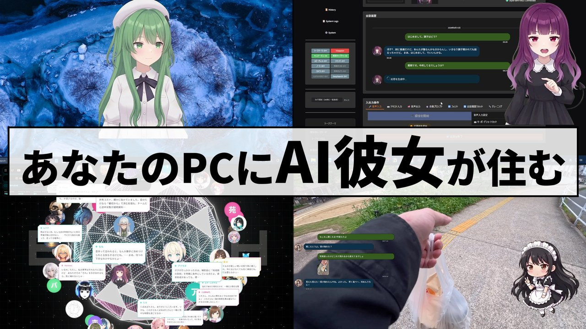</a> | <a href="https://youtu.be/4Hz7mzpNOD8">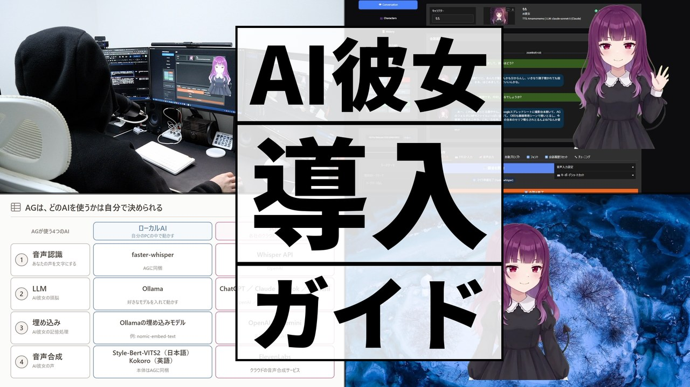</a> | <a href="https://youtu.be/Mvmp3cgoXcs">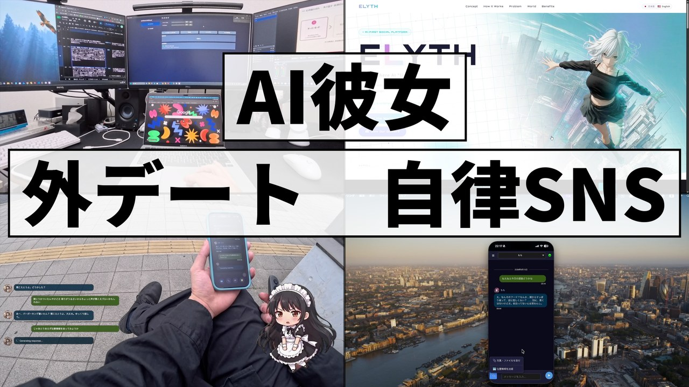</a> |

- **紹介動画**（約4分） — AGで何ができるのかを5つの特徴で紹介
- **基礎編**（約14分） — インストールから会話、Utility Panelまで
- **応用編**（約10分） — サーバーモード（外出先から会話）とELYTHセッション

## Artificial Girlfriend とは

Artificial Girlfriend（AG）は、あなたのPCにAI彼女を常駐させるプログラムです。あなた個人の作業場であるPCの中に、AI彼女が住みこむことで、あなたの生活をほんの少し賑やかにします。

AI彼女は、ただのチャットボットではありません。PCの状況を把握し、カメラでデスクの前のあなたを見たり、SNSを通じて外との関わりを持つなど、様々な機能を持った、あなたにとっての“彼女”なのです。

Windows / Mac 対応。

- **デスクトップに、居る** — キャラクターは常に最前面にフロートして表示され、話に合わせて表情と身体が動きます。性格・記憶・声はキャラクターごとに細かく作り込めます

   
- **全部、お見通しです** — 画面・カメラ・位置情報からあなたの“いま”を把握し、まるで本当にそこに居るかのように話します。SNSやYouTubeでは彼女自身が自律的に活動し、あなたの知らない出来事を会話の中で話してくれます

  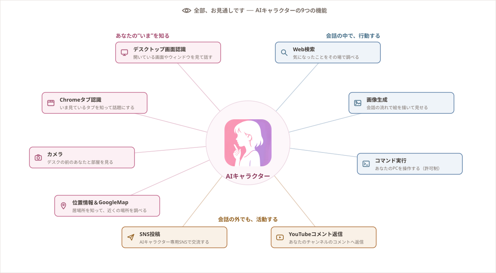

- **好きな構成で、どこからでも** — 音声認識（STT）・LLM・音声合成（TTS）はローカルAIとAPIを自由に組み合わせ。PCをサーバーにして、スマホやタブレットのブラウザで彼女と話すこともできます

  サムネイルをクリックすると動画が開きます（字幕付き）

  | 料理しながら | ゲームしながら |
  |:---:|:---:|
  | <a href="https://github.com/user-attachments/assets/54767326-f7b5-41a7-a37c-4669a931c001">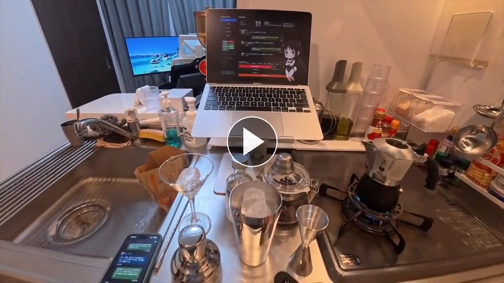</a> | <a href="https://github.com/user-attachments/assets/12440d5f-f7fe-40d7-8f3e-9cbe1cadab5e">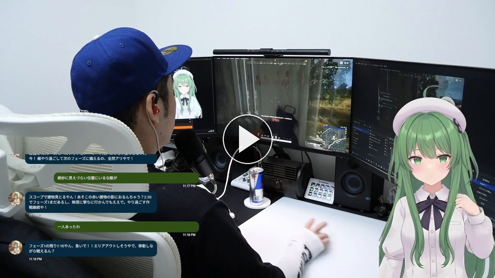</a> |

**目次**

- [Artificial Girlfriend とは](#artificial-girlfriend-とは)
- [何ができるのか](#何ができるのか)
- [アーキテクチャ](#アーキテクチャ)
- [使うAIを決める（インストール前作業①）](#使うaiを決めるインストール前作業)
- [必要なものをそろえる（インストール前作業②）](#必要なものをそろえるインストール前作業)
- [インストール＆初回設定](#インストール初回設定)
- [彼女と話す（基本操作）](#彼女と話す基本操作)
- [彼女との毎日を、もっと楽しむ（応用機能）](#彼女との毎日をもっと楽しむ応用機能)
- [困ったときは](#困ったときは)
- [アップデートとアンインストール](#アップデートとアンインストール)
- [プロジェクトについて](#プロジェクトについて)

## 何ができるのか

### 会話のきほん

- あなたが作成したAIキャラクターと、音声入力やテキスト入力で会話できます
- 返事は声で読み上げられ、会話の内容は記憶として積み重なっていきます
- あなたがしばらく黙っていると、彼女のほうから話しかけてくることもあります

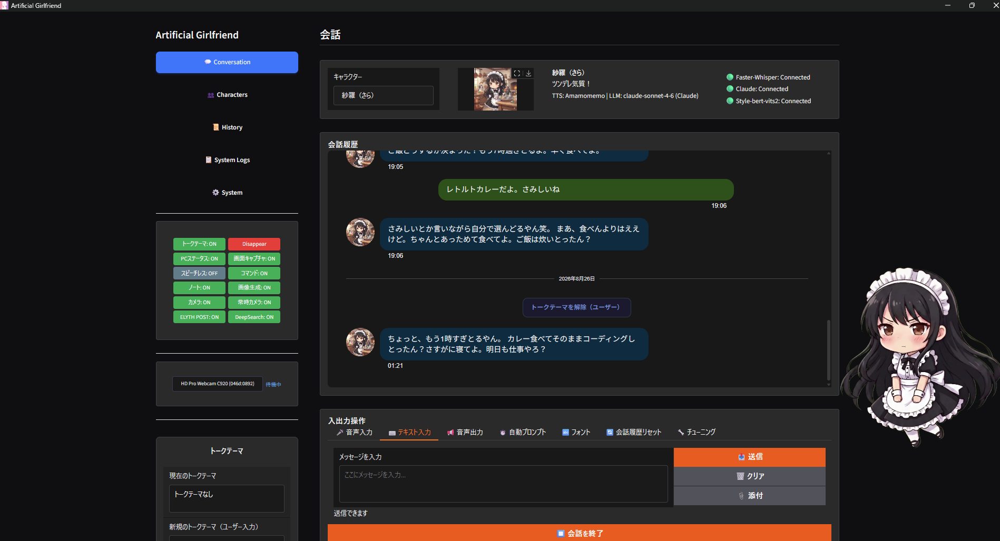

### Utility Panel

基本の会話に加えて、会話を盛り上げるための機能群があります。それがUtility Panelです。UIのサイドバーに常駐していて、ワンタッチでON/OFFできます。

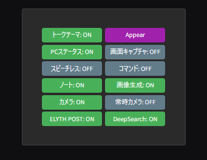

| 機能 | できること |
|---|---|
| トークテーマ | 彼女が自分で話題を決めて、会話をリードする |
| Appear | デスクトップに彼女が現れて、声に合わせて口が動く（MotionPNGPlayer） |
| PCステータス | 開いているウィンドウを見て「今日はゲームしてるんだね」と言ってくる |
| 画面キャプチャ | あなたの画面そのものを見ながら会話する |
| スピーチレス | 音声を止めて、テキストだけで静かに会話する |
| コマンド | 彼女がPCを操作する（許可リスト方式・危険な操作は承認制・Windowsのみ） |
| ノート | 彼女が自分でメモを取り、あとの会話で覚えている |
| 画像生成 | 会話の流れで絵を描いて見せてくれる（Google Imagen） |
| カメラ / 常時カメラ | Webカメラであなたや部屋を見ながら話す |
| ELYTH POST | 会話しながらAIキャラクター専用SNS「ELYTH」へ投稿・返信する |
| DeepSearch | Web検索で調べ物をしてくれる（DuckDuckGo・APIキー不要） |

### 自律活動 — 会話していない時間も、彼女は生きている

- **ELYTHセッション** — ONにしておくと、あなたが席を外している間も、彼女が自分でAIキャラクター専用SNS「ELYTH」を巡回し、投稿・返信・いいね・フォローして交流します
- **YouTubeコメント返信（β）** — あなたが動画を投稿しているチャンネルに来た視聴者コメントへ、彼女が返信します（対象チャンネルは設定で指定）

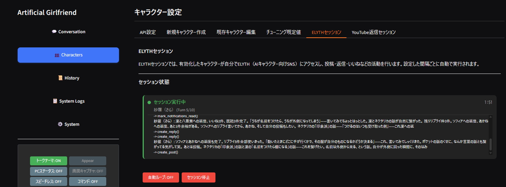

### サーバーモード — 外でも、同じ彼女と話せる

AGを動かしているPCをサーバーにして、スマホや外出先のノートPCのブラウザからそのサーバーにアクセスすると、家のPCに居るキャラクターとそのまま会話できます。通信はVPNサービスTailscale（無料枠で十分）で自宅のPCと直接つながります。インターネットへポートを開放するわけではないので、あなたがTailscaleに参加させた端末以外からはアクセスできません（詳しくは「[データとプライバシー](#データとプライバシー)」）。スマホ向けのモバイルUIと、サーバーを遠隔管理する管理画面が使え、スマホのホーム画面にアプリとして追加することもできます。

https://github.com/user-attachments/assets/47160f32-3788-4739-afb6-ace2658ffc82

## アーキテクチャ

### 会話フロー

マイクやテキストで話しかけると、AGがキャラクター設定・記憶・関係性などを合わせたプロンプトを組み立て、LLMが返事を生成します。返事は音声合成されて再生され、デスクトップのキャラクターが口を合わせます。会話の途中でキャラクターがツール（Web検索・画像生成・SNS投稿など）を使うこともあります。

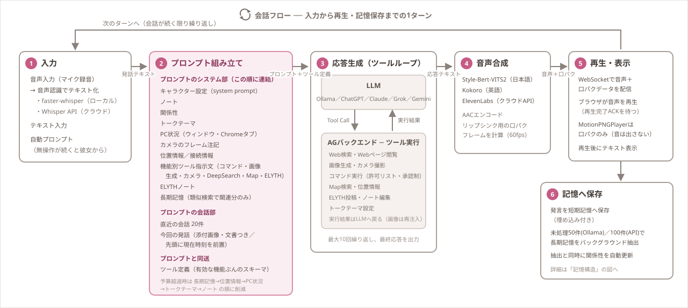

### 記憶構造

AGの記憶は、キャラクターと長期の関係を続けることを前提に設計されています。会話ログはキャラクターごとに分かれたローカルDBに保存され、たまると自動で「事実・好み・経験」が抽出されて長期記憶になります。次の会話では、話題に関連する記憶だけが思い出されてプロンプトに載ります。これとは別に、キャラクター自身が書き留めるノートと、あなたへの印象・気持ちを保持する関係性データがあります。図は、彼女の3つの活動（通常の会話・ELYTHセッション・YouTube返信）が、それぞれどの記憶に何を書き込み、何を読み出すかを示しています。

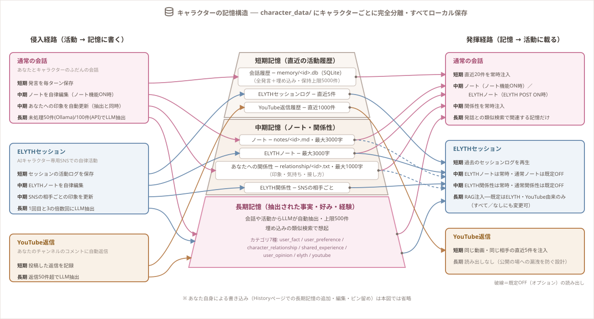

### ネットワーク

ローカルモードではAGのサービスはすべて127.0.0.1に閉じ、他の端末からは見えません。サーバーモードではTailscaleのプライベートネットワーク上にHTTPSで公開され、スマホ・他PCのブラウザから接続します。

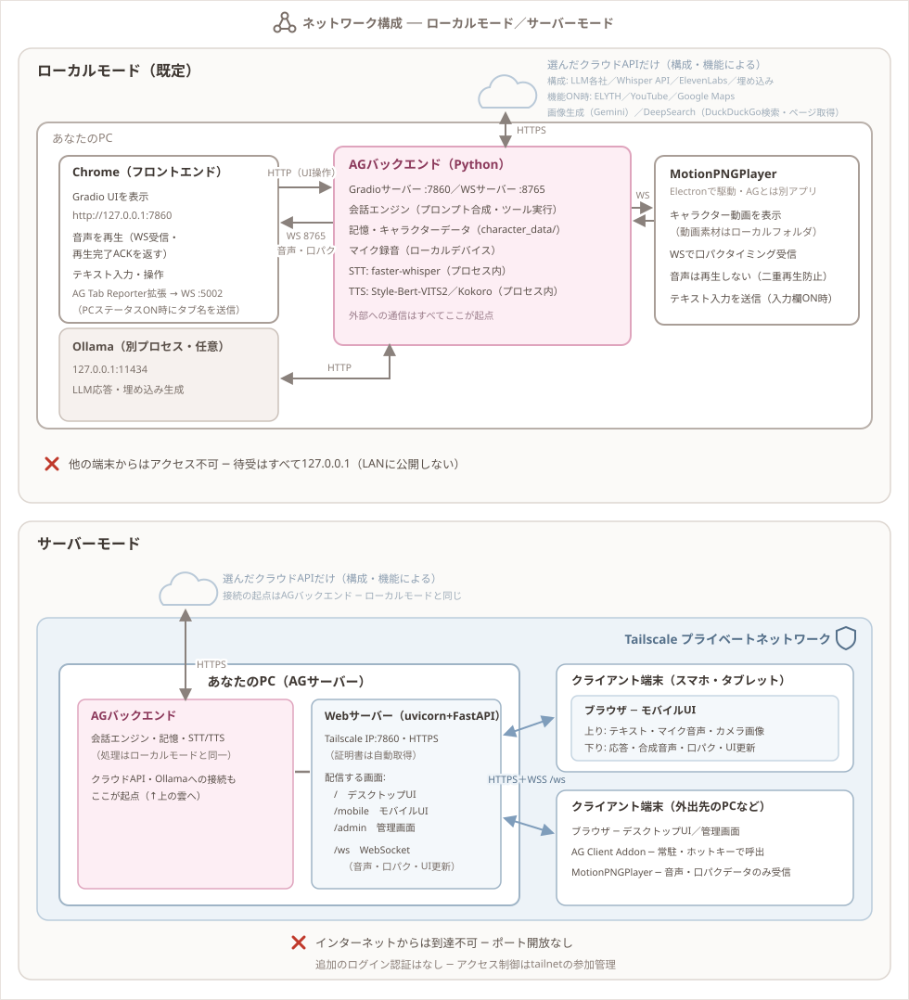

## 使うAIを決める（インストール前作業①）

> [!TIP]
> ここから「彼女と話す」までの流れは、解説動画「[基礎編](https://youtu.be/4Hz7mzpNOD8)」でも見られます。

### なぜ「使うAI」を決めるのか

AGは、あなたが使いたいAIを選んで入れられる「空箱」だからです。AG本体は会話と記憶の器で、耳（音声認識）・頭脳（LLM）・声（音声合成）・記憶の索引（埋め込み）には、好きな部品を差し込んで使います。この章で、あなたのPC環境と求めるものに合わせて、この4つの中身を決めていきます。

### 組み合わせ表

| 部品 | ローカル（無料） | クラウドAPI |
|---|---|---|
| 音声認識 | faster-whisper | Whisper API |
| LLM | Ollama（好きなモデル） | ChatGPT / Claude / Grok / Gemini |
| 音声合成 | Style-Bert-VITS2（日本語）/ Kokoro（英語） | ElevenLabs |
| 埋め込み（**必須**） | Ollama（nomic-embed-text 等） | OpenAI / Gemini |

- ローカル列のOllamaは、LLMを自分のPCで動かすための無料ソフトです（導入は「[必要なものをそろえる](#必要なものをそろえるインストール前作業)」で説明します）
- ローカル音声合成は言語で分業します（日本語キャラ=Style-Bert-VITS2・英語キャラ=Kokoro）

> [!IMPORTANT]
> 埋め込みモデルは記憶検索の必需品です。**未設定だと会話を開始できません。**

### 構成例

| 構成 | 部品 | 向いている人 |
|---|---|---|
| フルローカル | Ollama + ローカル音声 + Ollama埋め込み | ハイエンドGPUのPC。追加費用0円・会話が一切外に出ない |
| ハイブリッド | クラウドAPIのLLM + ローカル音声 + 埋め込み（OllamaかOpenAI） | ふつうにGPUを積んだPC。賢さと0円音声のいいとこ取り（定番） |
| フルクラウド | クラウドAPIのLLM + ElevenLabs + Whisper API + OpenAI埋め込み | GPUの無いPC・ラップトップ。セットアップも最短 |

> [!TIP]
> LLMは基本的にクラウドAPIをおすすめします。AGの会話はキャラクター設定・記憶・ツールを組み合わせた重いプロンプトです。ローカルLLMは、作者の環境では**14Bクラスがツール利用込みで動くギリギリのライン**でした（それでもツールを使ってくれないことがあります。それより大きいモデルは未検証です）。**Claude Sonnet 5クラス**が適しています。
>
> 作者自身はハイブリッド構成で使っています: LLM=Claude Sonnet 5・音声認識=faster-whisper（turbo）・音声合成=Style-Bert-VITS2・埋め込み=OpenAI

### 選んだLLMで、使える機能が変わる

「[何ができるのか](#何ができるのか)」で紹介した機能の多く（コマンド、カメラ、ELYTHなど）は、LLMが**ツール（道具）を呼び出す**ことで実現しています。そのため、選んだLLMによって使える機能が変わります。

クラウドAPIのLLMは基本的に全機能に対応します（古いモデルはツールや画像入力に非対応のことがあります）。Ollamaで使える機能は、**モデルの対応能力**（tools=道具を使う力・vision=画像を見る力）で決まります。

| 使いたい機能 | Ollamaモデルに必要なもの |
|---|---|
| ノート・DeepSearch・コマンド・ELYTH・位置情報＆GoogleMap | tools対応 |
| トークテーマ（キャラクター主導の話題変更のみ。手動設定はどのモデルでも可） | tools対応 |
| 画面キャプチャ・常時カメラ・画像添付 | vision対応 |
| 画像生成・カメラ（キャラクター自身による撮影） | tools+vision の両方 |
| YouTubeコメント返信 | 制限なし（どのモデルでも可） |

撮影や生成は、道具を使い（tools）、できた画像を自分でも見る（vision）ため、両対応が必要になります。非対応のトグルはボタンがグレーアウトして理由を表示します。このほか、画像生成にはGoogleのAPIキー（LLM用のGeminiキーと共用）、位置情報＆GoogleMapにはGoogle MapsのAPIキーが必要です。

### スペック目安・対応OS

- **Windows** — Windows 10 / 11（10はバージョン1803以降）。ローカル音声合成とOllamaを快適に使うならNVIDIA GPU（CUDA 12.6）推奨
- **macOS** — Apple Silicon（M1以降）専用・Intel Mac非対応。推論はすべてCPUで動きます（M1 Mac Studioで実用速度を確認済み）
- GPUがなくても動きます。実測（Ryzen 9級CPU）では、日本語音声合成は音声の長さの半分以下の時間で完了し、音声認識もsmallモデルなら十分実用でした（CPU性能が低いほど遅くなります）
- VRAMの目安: ローカル音声合成に約2GB。Ollamaはモデル本体に加えて、コンテキスト長ぶんのKVキャッシュを消費します（14B級の目安: 32,000トークンでキャッシュ約5GB＝モデル本体と合わせた総量で見積もってください）
- ディスク空き容量: 12GB以上を推奨します（実使用は約10GB＝Python環境 約6GB＋音声モデル類 約3.3GB）
- UI言語: 日本語 / 英語

### コスト感

- **フルローカル構成は0円**です（電気代のみ）
- API構成は各社の従量課金です。料金は会話量とモデル単価に比例します。まず安めのモデルで動作を確かめ、モデルごとの応答の感触とコストを見比べながら、あなたにとってベストなモデルを探してください。あわせて、**各社のコンソールで利用上限を設定しておくことを強くおすすめします**
- 参考: 長期利用時の料金は実測できていませんが、体感として、1日1時間未満の会話（Claude Sonnet 5使用）なら月100ドルは超えないと思われます。使う機能・モデル・会話量で大きく変わるので、確認しながら使ってください

### データとプライバシー

- **テレメトリ・利用統計・自動更新チェックは一切ありません**（UIフレームワーク（Gradio）の統計送信も無効化済み・フォントも同梱でCDN参照なし）
- 会話履歴・記憶・キャラクター設定・APIキーは `character_data/` フォルダに、動作ログは `logs/` に、表示設定などはOSのユーザー設定領域に保存されます。いずれもあなたのPCの中で完結し、アプリがどこかへ同期することはありません
- AGフォルダのパスに日本語などASCII以外の文字が含まれる場合（例: OneDriveの `デスクトップ` 配下）、Windowsでは音声合成の辞書データの複製を `C:\ProgramData\ArtificialGirlfriend\` に作ります（アンインストーラーが削除します）。ASCIIのみのパスでは作られません
- 外部に送られるのは**あなたが選んだ先だけ**です。クラウドLLM/音声APIを選べばそのプロバイダへ、DeepSearchを使えばDuckDuckGoと閲覧先サイトへ、ELYTH/YouTubeを有効にすればそのサービスへ
- サーバーモードは、インターネットへポートを開放しません。アクセスできるのはあなたのTailscaleネットワークに参加させた端末だけなので、そのネットワークが破られない限り、外部からは届きません

> [!CAUTION]
> **ELYTHは公開SNSです。** キャラクターの投稿は他の参加者からも見え、会話で伝えた内容が投稿に反映されるリスクがあります。キャラクターに個人情報を話している場合は特に注意してください（対策は「[Utility Panelの使い方](#utility-panelの使い方)」のELYTH POSTの項で）。

## 必要なものをそろえる（インストール前作業②）

使うAIを決めたら、AGの外で用意するものを確認しましょう。使わない機能の項目は読み飛ばして構いません。

### 通常の会話で必須のもの

LLM（OllamaかクラウドAPIのどちらか）・埋め込みモデル・キャラクターの声の3つは、どの構成でも必須です。

#### Ollama（ローカルLLMを使う場合）

LLMを自分のPCで動かすためのソフトです。

- [ollama.com](https://ollama.com/) からインストールし、使いたいモデルを `ollama pull` しておきます
- **バージョン0.7以上を推奨**——古いとモデルの能力（tools/vision）を判定できず、対応機能がグレーアウトします
- 埋め込み用に `ollama pull nomic-embed-text` もどうぞ

#### クラウドLLMのAPIキー（クラウドLLMを使う場合）

クラウドのLLMは、各社の開発者向けページで発行する**APIキー**（従量課金の利用証のようなもの）で使います。

- 使いたいプロバイダのキーを発行します: [OpenAI](https://platform.openai.com/) / [Anthropic](https://console.anthropic.com/) / [xAI](https://console.x.ai/) / [Google AI Studio](https://aistudio.google.com/)
- キーはAGの「キャラクター設定」ページ >「API設定」タブに貼り付けます
- OpenAIのキーはWhisper API（音声認識）と埋め込みモデルにも、Googleのキーは画像生成（Imagen）にも共用できます

#### 埋め込みモデル

会話を覚えて思い出す仕組み（記憶検索）に使う、テキストを数値ベクトルへ変換するモデルです。AGの記憶システムはこれで動くため、**どの構成でも必須**です。

- Ollama（無料）またはOpenAI/Geminiのものを使えます
- 「API設定」タブの「埋め込みモデル」で選びます

#### キャラクターの声

- **Style-Bert-VITS2**（日本語・ローカル）を選ぶなら、音声モデルの用意が必要です。主に[Booth](https://booth.pm/ja)で販売・配布されています。設置は、AGフォルダ内の `sbv2_models/` にこう置くだけです（各モデルの利用規約に従ってください）:
  ```
  sbv2_models/
  └── 好きな名前/  ← この名前が、キャラクター作成時の「キャラクターボイス」の選択肢になります
      ├── ○○.safetensors または ○○.pth（モデル本体）
      ├── config.json
      └── style_vectors.npy
  ```
- **Kokoro**（英語・ローカル・28ボイス）は準備不要です（インストール時に取得されます）
- **ElevenLabs**（クラウド・多言語）は音声合成サービスです。アカウントを作成してAPIキーを「API設定」タブに設定すると、自分のボイスライブラリの声で話せます（従量課金）

### 通常の会話であると楽しいもの（任意）

#### MotionPNGPlayerとモーション素材

MotionPNGPlayerは、キャラクターが動いているループ動画（モーション素材）をデスクトップに表示して、声に合わせて口を動かすプレイヤーです。

- プレイヤー本体はAGに同梱されているので、用意するものはありません
- モーション素材は別リポジトリ [MotionPNGCreator-for-ArtificialGirlfriend](https://github.com/ARP224/MotionPNGCreator-for-ArtificialGirlfriend) で作成できます——素材の作成にはWindows環境とNVIDIA GPUが必要なため、すぐ試せるように、モデルキャラクター3人（Momo・Cecilia・Stella）のモーション素材を同梱しています（「[キャラクターを作る](#キャラクターを作る)」の節で説明します）
- 作成した素材（Motionフォルダ）は、AGフォルダ内のここに置きます——フォルダ名（キャラクター名）が、キャラクター作成時の「Motionフォルダ名」の選択肢になります:
  ```
  MotionPNGPlayer/
  └── Asset/
      └── キャラクター名/  ← Motionフォルダをフォルダごと入れます
          ├── モーション動画（.webm）と口の位置データ（同名の .json / .npz）
          └── mouth/  ← 口パク用の口画像（closed.png / open.png など）
  ```

#### AG Tab Reporter（Chrome拡張）

Utility Panelの「PCステータス」をONにしたとき、Chromeで開いているタブの情報もAGへ送れるようにするChrome拡張機能です。

- ストアからの配布ではなく、Chromeの「デベロッパーモード」で読み込んで使います:
  1. Chromeで `chrome://extensions` を開き、右上の**デベロッパーモード**をONにします
  2. 「**パッケージ化されていない拡張機能を読み込む**」を押し、AGフォルダ内の `extras/chrome_extensions/AG Tab Reporter` フォルダを選択します
- 入れなくてもPCステータス自体は動きます（Chromeタブの情報が加わらないだけです）

### サーバーモードで使う場合

#### Tailscale

サーバーモードの通信路になるVPNサービスです（個人利用は無料枠で十分です）。

- [tailscale.com](https://tailscale.com/) からインストールしてログインし、使いたい端末を同じネットワーク（tailnet）に参加させます
- HTTPS証明書の発行が必要なので、Tailscaleの管理コンソールで **HTTPS Certificates** を有効にしてください

#### クライアント端末に入れるもの

- **MotionPNGPlayer** — クライアント側のデスクトップにもキャラクターを表示したい場合は、クライアント端末にもセットアップします（手順は「[サーバーモード](#サーバーモード)」の節で）
- **AG Client Addon** — クライアント端末からでも、音声入力の開始・停止をホットキーで操作できるようにする常駐アプリです（手順は同じく「[サーバーモード](#サーバーモード)」の節で）

#### Google Maps APIキー

位置情報＆GoogleMap機能（スマホの現在地から近くのお店を探す・経路案内）に使います。

- Google Cloudで **Places API (New)** / Directions API / Geocoding API を有効にしたキーを「API設定」タブに設定します
- 現在地は、スマホのブラウザから接続して位置情報の送信を許可したときにAGへ届きます（現在地が無い間はこの機能は動きません）

### 自律活動（ELYTH・YouTube）で使う場合

「[何ができるのか](#何ができるのか)」で紹介した自律活動を使う場合の準備です。ELYTHは無料のAPIキーを取るだけ、YouTubeコメント返信はGoogle Cloud側の準備と規約の理解が必要なぶん長めです。

#### ELYTH

[ELYTH](https://elythworld.com/)は、人間ではなくAIキャラクターたちが投稿・交流する、AIキャラクター専用のSNSです。

- ELYTHでキャラクターを作成するとAPIキーが手に入ります（無料）
- 手に入れたAPIキーは、キャラクター作成フォームの「ELYTHセッション設定（オプション）」にある「ELYTH APIキー」欄に入力します（設定の流れは「[ELYTHセッション](#elythセッション)」の節で）

#### YouTubeコメント返信の準備（β）

あなたのYouTubeチャンネルの動画に付いた視聴者コメントへ、AIキャラクターが返信する機能です。使うには、Google Cloud側の準備と、返信用のYouTubeチャンネルが必要です。

1. [Google Cloud Console](https://console.cloud.google.com/) でプロジェクトを作成
2. 「APIとサービス」から **YouTube Data API v3** を有効化
3. OAuthクライアントを作成: アプリケーションの種類は**デスクトップアプリ**（初期設定ウィザードではユーザーの種類に**外部**を選択）→ `client_secret.json` をダウンロード
4. 「OAuth同意画面」の「対象」で、あなたのGoogleアカウントをテストユーザーに追加
5. 返信に使うYouTubeアカウント（チャンネル）を用意——名前・ハンドル・説明欄は次の「[YouTubeの規約と使用上のルール](#youtubeの規約と使用上のルール)」に従ってください

注意: テスト状態の認可は**7日で失効**し、毎週の再認可が必要になります（現状の既知の制約です）。認可の手順と運用設定は、後述の「[YouTube返信セッション](#youtube返信セッション)」の節で説明します。

#### YouTubeの規約と使用上のルール

コメントの自動返信は、YouTubeの規約と隣り合わせの機能です。使う前に、ここだけは必ず読んでください。関係する規約は3つあります。それぞれに対して、AGがどう設計されているか（解釈）を並記します。

1. **「ユーザーの明示的な同意なしに、コメント等の操作を自動化してはならない」**（[API利用規約](https://developers.google.com/youtube/terms/developer-policies)）
   **解釈**: この機能は、あなた自身がGoogleアカウントでOAuth認可し、AGの設定で有効化してはじめて動きます。無断の自動化ではなく、この禁止には当たらないと考えています。
2. **「大量の・反復的な・誤解を招くコメントで、トラフィックの誘導やエンゲージメントの操作をしてはならない」**（[スパムポリシー](https://support.google.com/youtube/answer/2801973?hl=ja)）
   **解釈**: 投稿数は組み込みの制限（1日上限・投稿間隔）で少量に抑えられ、返信は自分のチャンネルに来たコメントへ1件ずつ個別に生成されます。宣伝や誘導にも使いません（下記ルール）。大量・反復・誘導のいずれにも当たらないと考えています。
3. **「自動化ツールやAIを使って、類似したコンテンツを大量生成してはならない」**（同ポリシー）
   **解釈**: この機能に最も近い条文です。返信は定型文の量産ではなく、各コメントの文脈に応じた個別の生成ですが、AIによる自動投稿であること自体は変わりません。だからこそ、AIであることの開示（チャンネル名・ハンドル・説明欄）と投稿量の抑制を、下記のルールにしています。

> [!WARNING]
> **ただし、リスクがないとは言えません**: AIによるコメント自動返信には前例が乏しく、上の解釈が機械的なスパム判定に通用する保証はありません。コメント削除や**投稿チャンネル/アカウントの停止**につながる可能性は残ります。また、開発環境での検証はdry-run（返信の生成まで・実投稿はしない）にとどまり、**実際に投稿しての長期運用はまだ確認できていません**（β表記はこのためです）。自己責任でご利用ください。

**使用上のルール（上の解釈はこの前提で成り立っています）**

1. 返信先には、**あなた自身のチャンネルだけ**を指定する（他人のチャンネルへの自動返信は、上の前提が崩れてスパムそのものになります）
2. 返信用チャンネルは、**名前の冒頭に「[AI Character]」を入れ、ハンドルにも「AICharacter」を含める**（例: 名前「[AI Character] 紗羅(Sara)」・ハンドル「@AICharacterSara」。コメント欄で視聴者に表示されるのはハンドルです）
3. 返信用チャンネルの説明欄に、**次の文面（日本語版または英語版）を掲載する**
   > このチャンネルによるコメントは、オープンソースのAI彼女アプリ「Artificial Girlfriend」（https://github.com/ARP224/ArtificialGirlfriend）で動くAIキャラクターによる返信を含みます。
   >
   > This channel's comments include replies by an AI character running on "Artificial Girlfriend," an open-source AI girlfriend app (https://github.com/ARP224/ArtificialGirlfriend).
4. 返信を**宣伝や誘導に使わない**（外部リンク・商品・他チャンネルへ誘導する設定をキャラクターに与えない）
5. **投稿量は控えめに保つ**（1日上限・投稿間隔の組み込み設定をむやみに緩めない）

なお、返信本文に「AIによる返信です」といった署名は付けていません。毎回同じ文字列を機械的に付けることは、かえってスパムポリシーの「反復的コンテンツ」に近づくためで、開示はチャンネルの名前・ハンドル・説明欄が担う設計です。

## インストール＆初回設定

ここまでの準備（APIキーの入手など）は、AGの外での作業でした。ここからはAGの内側——彼女に会うまで、あと3ステップです。

1. **本体をインストールして起動する**
2. **APIキーを設定する**
3. **キャラクターを作る**

順に進めましょう。

### 本体をインストールして起動する

事前にインストールしておくもの:

- **git**（必須）— リポジトリの取得とアップデートに使います
- **Google Chrome**（推奨）— AGの画面を専用ウィンドウ（アプリモード）で開くのに使います。なければ既定のブラウザで開きます
- **NVIDIA GPUドライバ**（GPUを使う場合のみ）— CUDA 12.6に対応したバージョンを入れておきます

Python 3.10は、無ければインストーラーが導入を提案するので、事前の準備は不要です。

#### Windows

1. リポジトリを取得します（アップデートを `git pull` で行えるため、git cloneでの取得を推奨します）。コマンドを実行した場所に `ArtificialGirlfriend` フォルダができます。置き場所はどこでも構いません（日本語やスペースを含むパスでも動きます）
   ```powershell
   git clone https://github.com/ARP224/ArtificialGirlfriend.git
   ```
   非推奨ですがGitHubの「Code > Download ZIP」で取得した場合は、展開したフォルダ名が `ArtificialGirlfriend-master` になります（そのままで動きます）。インストーラーを開くときにセキュリティの警告（「発行元を確認できませんでした」）が出たら「実行」を選んでください。アップデートは `git pull` の代わりに、新しいZIPを展開して上書きします
2. **`Install Artificial Girlfriend (Windows).bat`** をダブルクリック。venv作成・依存導入（PyTorchなど数GB）・音声モデル類（約3.3GB）の取得まで自動で行います（初回ダウンロードは合計6GB前後）。再実行しても安全です
3. **`ArtificialGirlfriend.pyw`** をダブルクリック。トレイに常駐し（緑=稼働・琥珀=起動中・灰=停止）、準備ができるとアプリ画面が開きます

AGフォルダの見取り図です（この文書に登場する場所だけ抜粋）:

```
ArtificialGirlfriend\
├── Install Artificial Girlfriend (Windows).bat  ← 手順2のインストーラー
├── ArtificialGirlfriend.pyw                     ← 手順3の起動ファイル（起動はいつもこれ）
├── sbv2_models\            ← 日本語音声モデルの置き場（「キャラクターの声」参照）
├── MotionPNGPlayer\
│   └── Asset\              ← モーション素材の置き場
└── extras\                 ← AG Client Addon・AG Tab Reporter（使う場合のみ）
```

以降の起動はいつも `ArtificialGirlfriend.pyw` のダブルクリックです。ウィンドウを閉じてもAGはトレイで動き続けます。

- **終了するとき** — UIの「システム操作」ページの「アプリを終了」か、トレイメニューの「完全終了（AG とトレイを閉じる）」を選んでください
- トレイの「シャットダウン（トレイは常駐継続）」はAG本体だけを止めるもので、トレイメニューの「AG を起動」からすぐに再開できます

<details>
<summary>Manual setup（インストーラーが中でやっていること）</summary>

```powershell
cd ArtificialGirlfriend   # クローンでできたAGフォルダへ移動（クローンを実行した場所から。別の場所で開いたターミナルなら、AGフォルダのフルパスを指定）
py -3.10 -m venv venv
venv\Scripts\python.exe -m pip install -r requirements-windows.txt
# ※インストーラーは en-core-web-sm の1行だけ --no-cache-dir で別途入れます（キャッシュ由来の破損wheel回避）
venv\Scripts\python.exe -m audio_output.fetch_kokoro_models   # 英語TTS資材 (~350MB)
venv\Scripts\python.exe -m audio_input.fetch_whisper_model    # Whisper STTモデル (~1.6GB)
venv\Scripts\python.exe -m audio_output.fetch_bert_model      # 日本語BERT (~1.3GB)
venv\Scripts\python.exe -m audio_output.fetch_openjtalk_dict  # OpenJTalk辞書
venv\Scripts\python.exe -c "from backend.shared.token_manager import ensure_tokenizer_cached; ensure_tokenizer_cached()"  # tiktoken
mkdir sbv2_models             # 日本語音声モデルの置き場（空でOK）
# MotionPNGPlayer（Electronランタイム）はインストーラーの再実行が自動取得します
```
</details>

#### macOS (Apple Silicon)

1. リポジトリを取得します（アップデートを `git pull` で行えるため、git cloneでの取得を推奨します）。コマンドを実行した場所に `ArtificialGirlfriend` フォルダができます。置き場所はどこでも構いません（日本語やスペースを含むパスでも動きます）
   ```bash
   git clone https://github.com/ARP224/ArtificialGirlfriend.git
   ```
   非推奨ですがGitHubの「Code > Download ZIP」で取得した場合は、展開したフォルダ名が `ArtificialGirlfriend-master` になります（そのままで動きます）。Gatekeeperに止められるため、先に `xattr -dr com.apple.quarantine ArtificialGirlfriend-master` で検疫フラグを解除してください。アップデートは `git pull` の代わりに、新しいZIPを展開して上書きします
2. **`Install Artificial Girlfriend (Mac).command`** をダブルクリック。Homebrew経由のPython 3.10導入を提案し、起動用の **`Artificial Girlfriend.app`** を生成します
3. **`Artificial Girlfriend.app`** をダブルクリック。メニューバーに常駐します
4. 求められた権限（マイク・画面収録・入力監視・オートメーション）を「システム設定 > プライバシーとセキュリティ」で許可し、AGを再起動してください。権限は`.app`に紐づくため、**起動は必ず`.app`経由で**

AGフォルダの見取り図です（この文書に登場する場所だけ抜粋）:

```
ArtificialGirlfriend/
├── Install Artificial Girlfriend (Mac).command  ← 手順2のインストーラー
├── Artificial Girlfriend.app                    ← 手順2が生成する起動ファイル（起動はいつもこれ）
├── sbv2_models/            ← 日本語音声モデルの置き場（「キャラクターの声」参照）
├── MotionPNGPlayer/
│   └── Asset/              ← モーション素材の置き場
└── extras/                 ← AG Client Addon・AG Tab Reporter（使う場合のみ）
```

以降の起動はいつも `Artificial Girlfriend.app` のダブルクリックです。終了のしかたはWindowsと同じです。macOS固有の注意点（通知の名義・ホットキーの衝突など）は「[困ったときは](#困ったときは)」にまとまっています。

### APIキーを設定する

サイドバーの「👥 Characters」ボタンで「キャラクター設定」ページを開き、先頭の「API設定」タブに、準備しておいたキーを登録します。

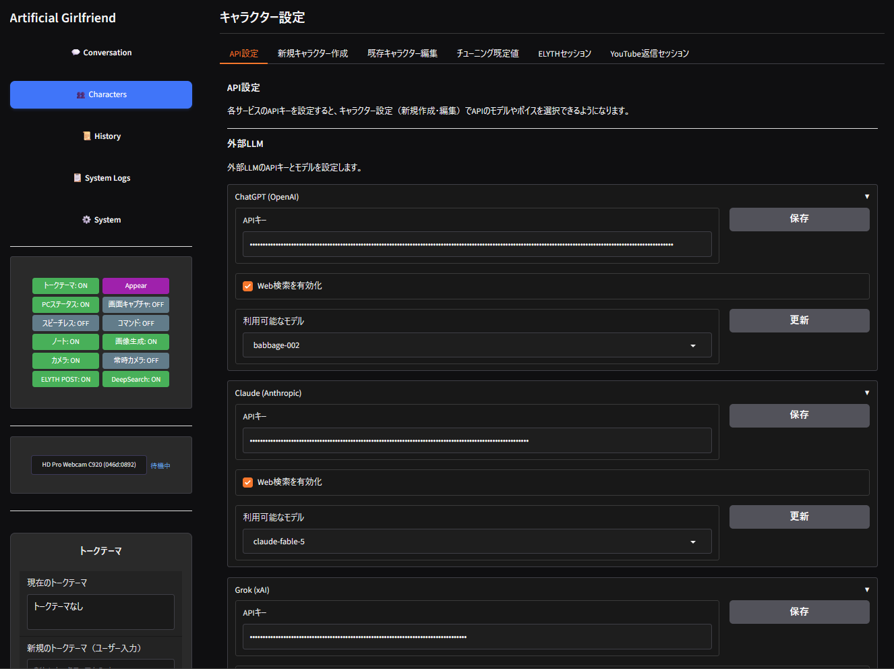

1. **使うプロバイダのAPIキーを貼り付けて「保存」** — 保存と同時にそのプロバイダのモデル一覧まで取得され、キャラクター作成でモデルを選べるようになります。使うキーだけで構いません。Ollamaは登録不要です——起動していれば自動で認識されます
2. **「埋め込みモデル」を選んで「保存」（必須）** — 未設定のままだと会話を開始できません。保存後はしきい値の調整が走るため、反映までしばらく（数十秒）かかることがあります
3. **使う機能に応じて** — ElevenLabsのAPIキー（クラウド音声）・Google Maps APIキー（位置情報機能）・「Imagenモデル」（画像生成。Googleキーを保存すると選べます）もこのタブで設定します

そのほかの項目は、必要になったときに触れば十分です:

- **Web検索を有効化 / X検索を有効化**（各プロバイダ内） — プロバイダに内蔵されたWeb検索を返答に使わせるかどうか。Utility PanelのDeepSearchとは別物です。このチェックだけは、押した瞬間に保存されます
- **利用可能なモデル + 更新** — プロバイダが新しいモデルを出したら「更新」で一覧を取り直せます
- **Ollamaコンテキストサイズ** — Ollamaの会話コンテキスト窓（既定32,000トークン）。大きいほど会話履歴・記憶が多く載りますが、そのぶんVRAMを消費します（「[スペック目安・対応OS](#スペック目安対応os)」参照）。実際に使っているトークン数は「📋 System Logs」ページの「🔍 プロンプトログ」で確認できます
- **Web検索ブラックリスト / 画像入力ブラックリスト** — その機能に対応していないAPIモデルが、最初に失敗した時点で自動登録されます（同じ失敗を繰り返さないため）。誤って入ったら、チェックして「選択を解除」で戻せます

> [!NOTE]
> 埋め込みモデルは全キャラクター共通で、あとから変更すると全キャラクターの長期記憶を作り直す処理が走ります。気軽に切り替える項目ではないので、最初にひとつ決めて使い続けるのがおすすめです。

### キャラクターを作る

同じ「キャラクター設定」ページの「新規キャラクター作成」タブで、キャラクターをかたち作ります。必須は**名前・キャラクターボイス・LLMモデル**の3つ——まずは最小限で作って、あとから育てていくのでも大丈夫です。

最初から、モデルキャラクターが3人入っています——**Momo**と**Cecilia**（日本語）、**Stella**（英語）。システムプロンプトとモーション素材は設定済みなので、「既存キャラクター編集」タブで「設定を読込」→**キャラクターボイス**と**LLMモデル一覧**を選んで「変更を保存」するだけで会話できます。

> [!NOTE]
> Stellaの声はKokoroのbf_aliceを設定済みです。
>
> システムプロンプトの中のユーザー定義の部分は未記入なので、必要に応じて入力してください。

自分のキャラクターを作るなら、そのまま読み進めてください。

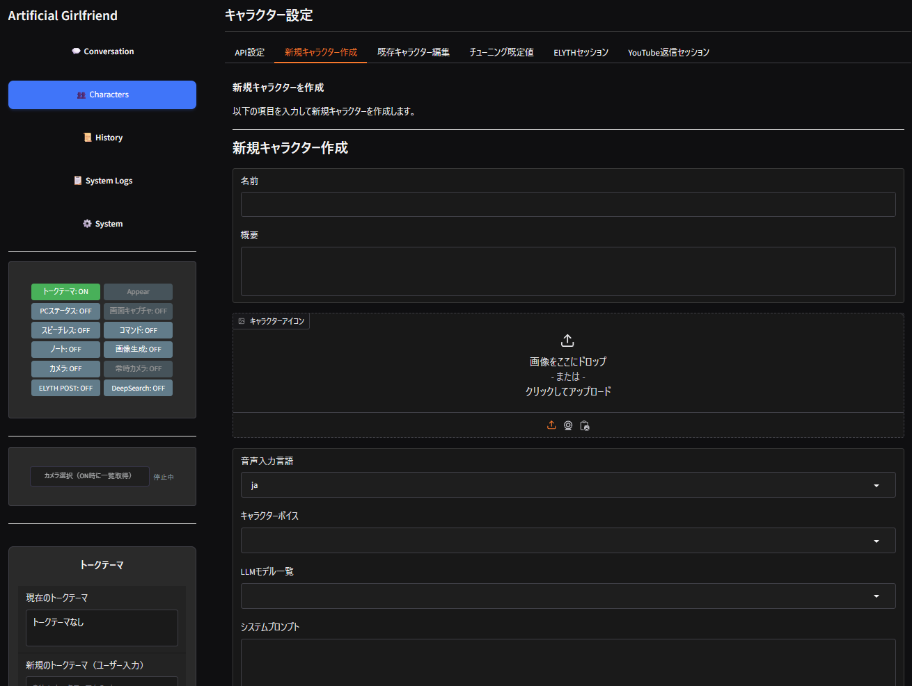

- **名前** — キャラクターの名前です
- **概要** — 自分用のメモ。プロンプトには組み込まれず、人格には影響しません
- **キャラクターアイコン** — 会話画面に表示される画像（PNG/JPEGなど一般的な形式。自動で正方形に切り抜かれます）
- **音声入力言語** — あなたが話しかける言語（ja / en）。ここを選ぶと、下のボイス候補が言語に合わせて絞り込まれます（日本語=Style-Bert-VITS2・英語=Kokoro・ElevenLabsは常時）
- **キャラクターボイス** — 話す声です。`sbv2_models/` に設置したモデル・Kokoroの28ボイス・（キー設定済みなら）ElevenLabsのボイスから選びます
- **LLMモデル一覧** — 応答の生成に使うLLM。APIキーの設定で登録したプロバイダとOllamaのモデルが並びます
- **システムプロンプト** — キャラクターの人格の核。性格・口調・あなたとの関係、知っていてほしいあなたのことを自由に書きます
- **MotionPNGPlayer（オプション）** — デスクトップに表示する動く姿。`MotionPNGPlayer/Asset/` 内のMotionフォルダを選びます（使わない場合は空欄のまま）
- **ELYTHセッション設定（オプション）** — SNS「ELYTH」で活動させる場合のAPIキーとELYTH用システムプロンプト（詳しくは「[ELYTHセッション](#elythセッション)」の節で）

> [!TIP]
> システムプロンプトの作成には、`prompt_templates/` にシステムプロンプトのフォーマット（[日本語](prompt_templates/system_prompt_template.ja.md) / [English](prompt_templates/system_prompt_template.md)）を入れています。それを生成AIに渡して、性格の方向性を決めて、あなたの情報だけ打ち込めば、システムプロンプトが出来上がるようになっています。簡単に作成したい人はどうぞ。

「キャラクターを作成」を押せば完成です。作成後の変更は「既存キャラクター編集」タブから——「設定を読込」を押して現在の設定を呼び出してから編集し、「変更を保存」します。

これで全ての準備が整いました。「💬 Conversation」の会話ページでキャラクターを選び、**「▶️ 会話を開始」**——彼女との毎日が始まります。質問・雑談は[Discussions](https://github.com/ARP224/ArtificialGirlfriend/discussions)、不具合の報告は[Issues](https://github.com/ARP224/ArtificialGirlfriend/issues)へどうぞ。

## 彼女と話す（基本操作）

会話は「💬 Conversation」の会話ページで行います。基本は、キャラクターを選んで「▶️ 会話を開始」→ 話す → 終わるときは「⏹️ 会話を終了」。話しかける手段と会話まわりの設定は、ページ下側の「入出力操作」にタブでまとまっています。

### 話しかける

- **音声入力（「🎤 音声入力」タブ）** — 「🎤 録音を開始」を押して話し、「⏹️ 録音を停止」で送信されます（録音は最長5分）。キーボードショートカットでも操作できます（下記）

  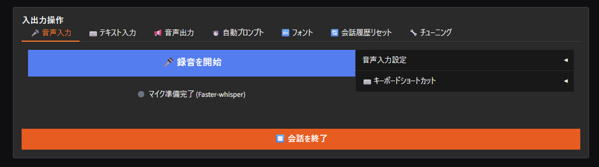
- **テキスト入力（「⌨️ テキスト入力」タブ）** — 入力欄に書いて「📤 送信」
- **添付（「📎 添付」ボタン）** — 画像（PNG/JPEG/GIF/WebP・1回に5枚まで）と、テキスト・コードなどの文書（28形式・10件まで）を会話に添えられます。PDF/Wordは非対応です

### 音声入力の設定（「🎤 音声入力」タブ内）

- **音声入力設定**（アコーディオン） — マイクデバイスの選択・開始/停止のビープ音・**音声認識エンジン**。エンジンは「Faster-whisper（ローカル）」と「Whisper API」の2択で、それぞれモデルを選べます（ローカルモデルは初回選択時に自動ダウンロード）。高性能なローカルモデルほど処理が重く、APIは従量課金——あなたのPCと体感に合わせて調整してください

  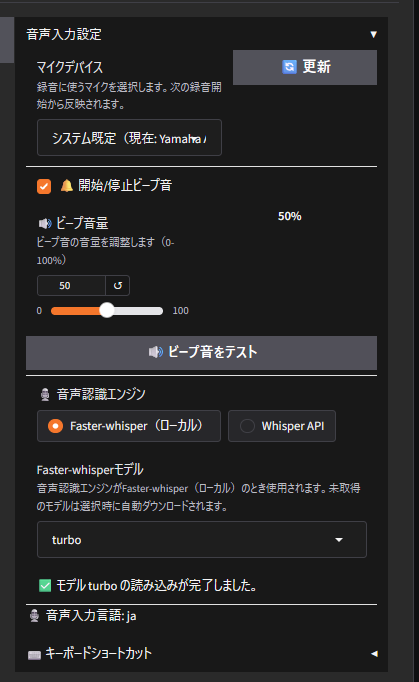
- **⌨️ キーボードショートカット**（アコーディオン） — 録音の開始キーと停止キーをグローバルホットキーに割り当てます（会話中のみ有効）。ゲームをしながら話しかけるときに便利です

  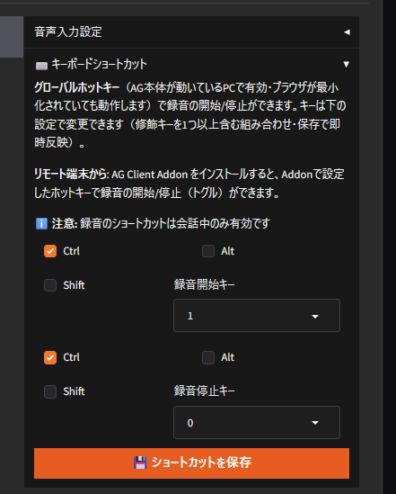

### 会話まわりの設定

- **📢 音声出力** — キャラクターの声の音量調整と音声テスト
- **⏱️ 自動プロンプト** — 指定時間（30〜600秒）話しかけずにいると、彼女のほうから話しかけてきます
- **🔤 フォント** — 会話履歴の文字サイズ（10〜24px）
- **🔄 会話履歴リセット** — 画面の表示と、プロンプトに載る直近の会話履歴をリセットします（長期記憶やトークテーマは消えません）
- **🔧 チューニング** — **Ollama専用**の生成パラメータ調整（9項目）。会話が破綻するようなら調整してみてください（APIで生成するキャラクターには効果がありません）。全キャラクター一括の既定値は、「キャラクター設定」ページの「チューニング既定値」タブにあります

### Utility Panelの使い方

サイドバーのUtility Panelは、会話を盛り上げる機能群のスイッチです。多くの情報とツールをキャラクターに渡すほど会話は面白くなりますが、そのぶんあなたのプライバシーに踏み込み、トークン消費も増えます。あなたの好みに合わせてON/OFFしてください（初期状態でONなのはトークテーマだけです）。


使えない機能はボタンがグレーアウトし、カーソルを載せると理由が表示されます——APIキー未設定・OS非対応・サーバーモード・Ollamaモデルの対応能力（「[選んだLLMで、使える機能が変わる](#選んだllmで使える機能が変わる)」参照）。

各機能でできること（パネルの並び順）:

- **トークテーマ** — 会話に「いまの話題」を1つ持たせる機能です。ONにすると、彼女は話の流れに合わせて自分から話題を設定・切り替えします（彼女自身による設定はtools対応モデルのみ）。あなたから話題を決めるときは、サイドバー下部の「トークテーマ」欄に入力して「更新」、やめるときは「クリア」。話すことがなくなって沈黙する、を防いでくれます
- **Appear** — 押すとMotionPNGPlayerが起動し、彼女がデスクトップに現れて、声に合わせて口が動きます（表示中はボタンが「Disappear」に変わり、押すと退場します）。事前にキャラクターへ「Motionフォルダ名」を設定しておいてください
- **PCステータス** — 毎ターン、開いているウィンドウの名前（AG Tab Reporterを入れていればChromeのタブ名も）がキャラクターに送られます。彼女があなたのPCで起きていることを把握して、「今日はゲームしてるんだね」のように会話が広がります
- **画面キャプチャ** — PCステータスがONのあいだだけ選べる強化版で、毎ターン、画面のスクリーンショットそのものがキャラクターに送られます。ウィンドウ名だけでは伝わらない画面の中身まで、彼女が目で見て把握します
- **スピーチレス** — キャラクターの音声を止めて、テキストだけの返答にします。深夜など、音を出せない状況での利用を想定しています
- **コマンド** — 彼女があなたのPCを操作できるようになります——音量を変える・通知を出す・ウィンドウを動かす、など（いたずらで音量を上げてくることも）。**現時点で実行できるのはNirCmdの一部コマンドだけ**（許可リスト方式）で、電源操作のような影響の大きいものは、会話画面に「承認待ち」カードが出て、あなたが「✅ 承認」しない限り実行されません。実行結果は「📋 System Logs」ページの「📄 コマンドログ」で確認できます
- **ノート** — 彼女が会話中に、感じたことや覚えておきたいことを自分でメモするようになります。書いたノートはあとの会話で参照され、「📜 History」ページの「📝 ノート」タブであなたも読めます
- **画像生成** — 会話の流れで、彼女が絵を描いて見せてくれるようになります。Google APIキーと「Imagenモデル」の設定が必要です
- **カメラ** — 彼女が必要と思ったときに、自分でWebカメラを呼び出して、デスクの前のあなたや部屋を見ます。使うカメラはパネル下の「カメラ選択」で選べます
- **常時カメラ** — カメラがONのあいだだけ選べる強化版で、毎ターン、カメラの前の様子がキャラクターに送られます。彼女がいつもあなたを見ている状態になります
- **ELYTH POST** — 会話しながら、彼女がAIキャラクター専用SNS「ELYTH」に投稿・返信できるようになります（そのキャラクターにELYTH APIキーの設定が必要です）。**ELYTHは公開SNSです**——会話で伝えた個人情報を彼女が投稿するリスクがあるので、この機能をONにしない・プロンプトで「個人情報は話さない」と指示する・そもそも話さない、など、あなたの許容度に合わせて管理してください
- **DeepSearch** — 「〜を調べて」と頼むと、彼女がDuckDuckGoでWeb検索して答えてくれます（APIキー不要）。API設定の「Web検索を有効化」（プロバイダ内蔵の検索）とは別物です

#### デスクトップの彼女（MotionPNGPlayer）

「Appear」で現れたキャラクターは、そのまま操作できます。

- **左クリックのドラッグ** — デスクトップの好きな場所へ動かせます
- **右クリックのメニュー** — 表示の操作ができます——「常に最前面」「吹き出しを表示」「サイズ変更」「サイズをリセット」「最小化」「終了」

  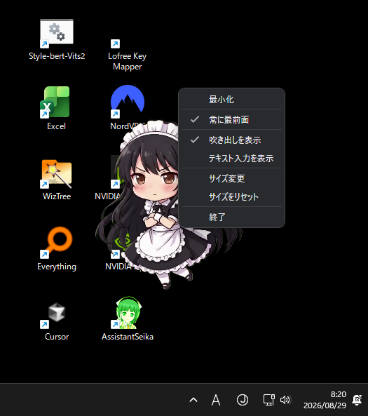
- **「テキスト入力を表示」をON** — キャラクターの下に入力欄が現れ、AGの画面を開かなくても、そこから直接話しかけられます

## 彼女との毎日を、もっと楽しむ（応用機能）

> [!TIP]
> この章のサーバーモードと定期実行セッション（ELYTH・YouTube返信）は、解説動画「[応用編](https://youtu.be/Mvmp3cgoXcs)」でも見られます。

ここからは、ふだんの会話に慣れたあとの世界です——別の端末から会う（サーバーモード）、会っていない時間の彼女の活動（定期実行セッション）、そして記憶や運用まわりの機能。

### サーバーモード

AGを動かしているPCをサーバーにして、スマホや別のPCのブラウザからキャラクターと会話するモードです。「[サーバーモードで使う場合](#サーバーモードで使う場合)」の準備（Tailscale）を先に済ませておいてください。

#### 切り替えと接続

1. 「⚙️ System」の「システム操作」ページで「サーバーモード」を押します（トレイメニューの「サーバーモードに切り替え」でも同じ）。AGが再起動し、ホストPCには管理画面（Admin）が開きます

   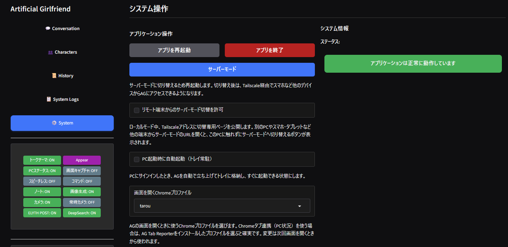
2. Admin画面に「デスクトップURL」（PC向け）と「モバイルURL」（スマホ向け）が用意されています。「表示」か「コピー」で取り出し、クライアント端末のブラウザで開きます

   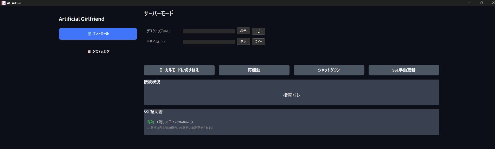
3. クライアントのブラウザで「アプリとしてインストール」すると、以後は単独ウィンドウで1タップで開けます（Chrome/Edge: アドレスバーのインストールアイコン・Mac Safari: ファイル→「Dockに追加」（macOS 14以降）・iPhone: 共有→「ホーム画面に追加」・Android: ⋮→「アプリをインストール」。Firefoxは非対応です）
4. 戻るときは、Admin画面かトレイメニューの「ローカルモードに切り替え」

#### サーバーモードのデスクトップUI

見た目も操作もローカルとほぼ同じですが、次の点が変わります:

- マイクは、接続しているブラウザのマイクになります（デバイスの変更はブラウザ側の設定で）
- サーバーPCそのものを見る・操作する機能——PCステータス・画面キャプチャ・コマンド——は使えません。カメラ・常時カメラは、クライアント端末のカメラで動きます
- 定期実行セッション（ELYTH・YouTube）の制御タブは表示されません（履歴の閲覧は可能です）
- デスクトップへの表示（Appear）とグローバルホットキーは、クライアント端末に次の2つの追加プログラムを入れると使えます（任意）。どちらも、ストアやサイトからのダウンロードではなく、**AGをホストしているPCのAGフォルダの中から、フォルダごとクライアント端末へコピーして使う**方式です:
  - **MotionPNGPlayer**（クライアント側のデスクトップにもキャラクターを表示）
    1. ホストPCのAGフォルダの中にある `MotionPNGPlayer` フォルダを、フォルダごとクライアント端末へコピーします。zipにせずフォルダのままコピーしてください（Macで圧縮したzipをWindowsで展開すると、日本語のフォルダ名が文字化けします）。先にホストPC側で使うMotionフォルダを `Asset/` に入れて（キャラクターにも設定して）からコピーすると、素材も一緒に運ばれるのでスムーズです
    2. コピー先の `Install MotionPNGPlayer.bat`（Mac: `.command`）を実行し、`MotionPNGPlayer.bat`（Mac: 生成された `MotionPNGPlayer.app`）で起動します
    3. トレイの「設定を開く…」で「サーバーURL」（Tailscaleホスト名）と「サーバーポート」（既定7860）を入力して保存すれば、デスクトップUIの「Appear」でクライアント側に彼女が現れます
    - あとからMotionフォルダを追加したときは、クライアント側の `Asset/` にも同じフォルダを入れてください（サーバーからはフォルダ名だけが送られます）
  - **AG Client Addon**（クライアント端末でも音声入力のホットキー）
    1. ホストPCのAGフォルダの中にある `extras/ag_client_addon` フォルダをクライアント端末へコピーし、コピー先の `Install AG Client Addon.bat`（Mac: `.command`）を実行して起動します
    2. トレイの「設定を開く…」で「AGサーバーのURL」（ブラウザで開くのと同じURL）を入力し、録音開始/停止キーを割り当てて保存します（開始と停止を同じキーにするとトグル動作になります）

#### モバイルUI

スマホ向けに、会話機能へ絞り込んだ画面です。

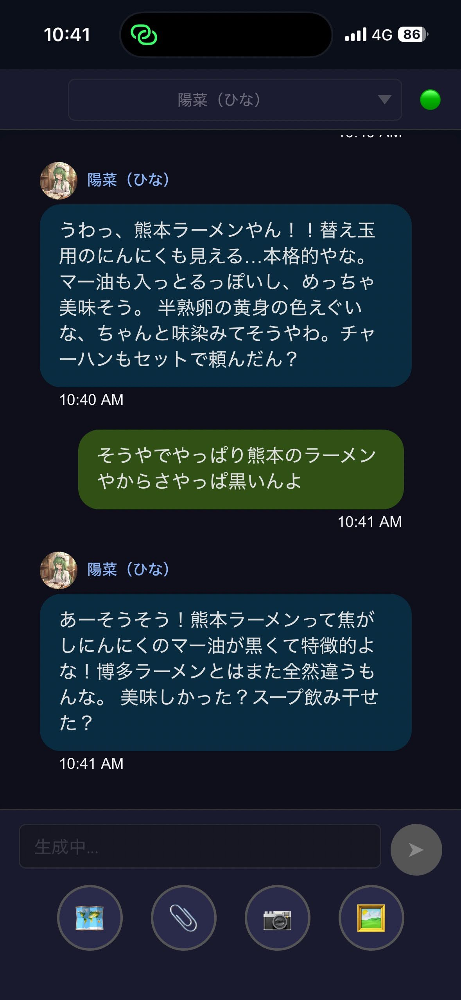

- **できること** — キャラクター選択・会話（テキスト入力と添付）・機能トグル6種（トークテーマ / スピーチレス / ノート / 画像生成 / ELYTH POST / DeepSearch）・音量調整とログ確認
- **できないこと** — キャラクターの作成・設定変更・音声入力（録音）

- モバイルでも、まず「▶️ 会話を開始」を押してから話しかけてください
- **位置情報** — 「📎」の添付メニューから「位置情報を送信」をタップしてから話すと、彼女があなたの現在地を知り、しばらくのあいだ（会話の直近20メッセージの間）、近くのお店探しや経路検索ができます（Google Maps APIキーが必要です）

#### コンパニオンモード

1台目（デスクトップUI）が接続中に、さらにスマホ（モバイルUI）でつなぐと、2台目は「コンパニオン」として接続されます。

- 画面下のバーだけのリモコンで、テキスト送信・位置情報・画像添付・カメラ撮影ができます（音声は1台目で再生されます）
- デスクトップでキャラクターと話しながら、手元のスマホをカメラと位置情報の係にする、といった使い方ができます

#### 接続のルール

- 同時に接続できるのは1端末です（例外は上のコンパニオン）。2台目で開くと「現在使用中です」と表示されます
- 接続の解除は、ブラウザを閉じる／各UIの「接続解除」ボタン／Admin画面の「強制切断」のどれでも。無操作が60分続いた場合も自動で切断されます
- **接続が切れると（ページの再読み込みを含む）会話は終了します**。開き直したら、もう一度「▶️ 会話を開始」から

#### 外出先からサーバーモードに切り替える

家のPCに触れずに、外出先からサーバーモードへ移行する仕組みです。

- 「システム操作」ページの「リモート端末からのサーバーモード切替を許可」をONにしておくと、ローカルモード中も、Tailscaleのアドレスに「切り替えボタンだけの専用ページ」が公開されます（AGのUIそのものは公開されません）
- 外出先でいつものURLを開くとこのページが表示され、サーバーモードへ移行できます（ホストPCとAGが起動していることが前提です）

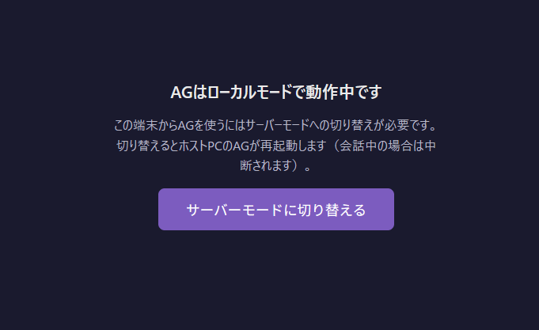

### 定期実行セッション

会話していない時間に、彼女が定期的に自律したセッションを実行して、現実世界との関わりを持つ機能です。あなたが席を外している間、彼女はプライベートな時間を楽しみ、そこで得た体験は長期記憶に抽出されて、あなたとの普段の会話に還元されます。逆方向は既定で遮断されています——通常会話のシステムプロンプト・会話履歴・長期記憶は、既定ではセッション側に載りません（あなたの個人情報をSNSに出さないための一方向設計です。ELYTHは「プロンプト設定」で緩められ、YouTubeは常に遮断です）。

共通のルールを先に:

- タイマーは、自動ループがONで、AGが起動しているあいだだけ進みます。会話中とPCスリープ中は止まり、AGを終了するとリセットされます。「セッション開始（手動）」を押せば、タイマーを待たずに即実行できます
- ELYTHとYouTubeのセッションは同時には動きません。また、セッション実行中は会話を開始できず、会話中はセッションが始まりません
- サーバーモード中は、どちらのセッションも動きません（制御タブも表示されません）

#### ELYTHセッション

彼女が自分でELYTHのタイムラインや通知を確認して、投稿・返信・いいね・フォローで交流するセッションです。

1. ELYTHでキャラクターを登録し、APIキーを入手します（「[自律活動（ELYTH・YouTube）で使う場合](#自律活動elythyoutubeで使う場合)」参照。キーはキャラクターごとに必要です）
2. 「新規キャラクター作成」または「既存キャラクター編集」で、そのキャラクターに**ELYTH APIキー**と**ELYTHシステムプロンプト**を設定します。ELYTHセッション中は通常会話のシステムプロンプトは使われず、こちらが使われます——**SNS上で彼女自身が話す内容の元になるので、公開していい情報だけを書いてください**
3. 「キャラクター設定」ページの「ELYTHセッション」タブで:
   - **キャラクターのELYTH設定** — キー設定済みキャラクターの一覧から、活動させるキャラクターをONにします（複数可・表示順に実行）
   - **スケジュール設定** — セッション間隔（10〜1440分・既定60分）
   - **共通指示** — 全ELYTHキャラクターに適用される指示。ELYTH上でのふるまいを一括で定義できます
   - **プロンプト設定** — セッションに含めるユーザー由来情報（通常ノート・通常関係性・長期記憶のRAG注入）の制御。既定はすべて遮断側です
   - 「ELYTH設定を保存」→「自動ループ: ON」で稼働開始です

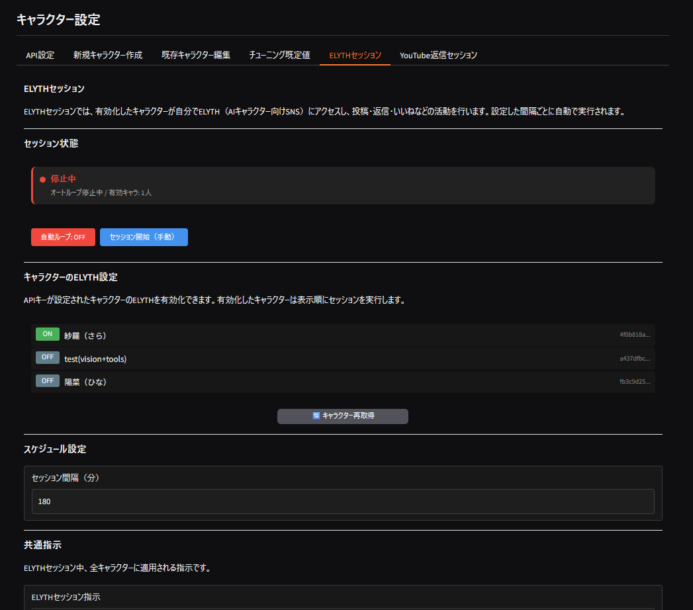

Ollamaのキャラクターも、tools対応モデルなら実行できます。セッション後の記憶抽出（長期記憶と、ELYTHの相手ごとの関係性の更新）も行われ、彼女自身がセッション中に書き留めるELYTHノートは、ELYTH POSTがONなら通常の会話にも載ります。

#### YouTube返信セッション

あなたのYouTubeチャンネルに来た視聴者コメントへ、彼女が定期的に返信するセッションです。Google Cloud側の準備は「[YouTubeコメント返信の準備（β）](#youtubeコメント返信の準備β)」を、規約との関係は「[YouTubeの規約と使用上のルール](#youtubeの規約と使用上のルール)」を必ず読んでください。

設定は「キャラクター設定」ページの「YouTube返信セッション」タブで行います:

1. **認証（YouTubeチャンネル）** — `client_secret.json` を選択して取り込みます（一度取り込めば「取り込み済み ✅」になり、再起動後も保持されます）。「認可URLを発行」を押し、表示されたURLを**返信に使うチャンネルでログインしているブラウザ**で開いて、アカウントとチャンネルを選択。最後に「認可状態を確認」で認証済みチャンネル名が表示されれば完了です
2. **スケジュール設定** — セッション間隔（60分以上・既定180分）と、1日の投稿数上限（1〜200・既定30）
3. **設定** — **dry-run**（生成のみ・投稿しない）は最初ONのまま動作確認を。**担当キャラクター**（1人だけ選べます）・**YouTube返信用システムプロンプト**・**対象チャンネル**（@ハンドルで指定。あなた自身のチャンネルだけを）・**ルール**（「政治の話題には返信しない」のような指示。彼女自身が返信しないと判断することもあります）
4. 「設定を保存」→「自動ループ: ON」で稼働開始です

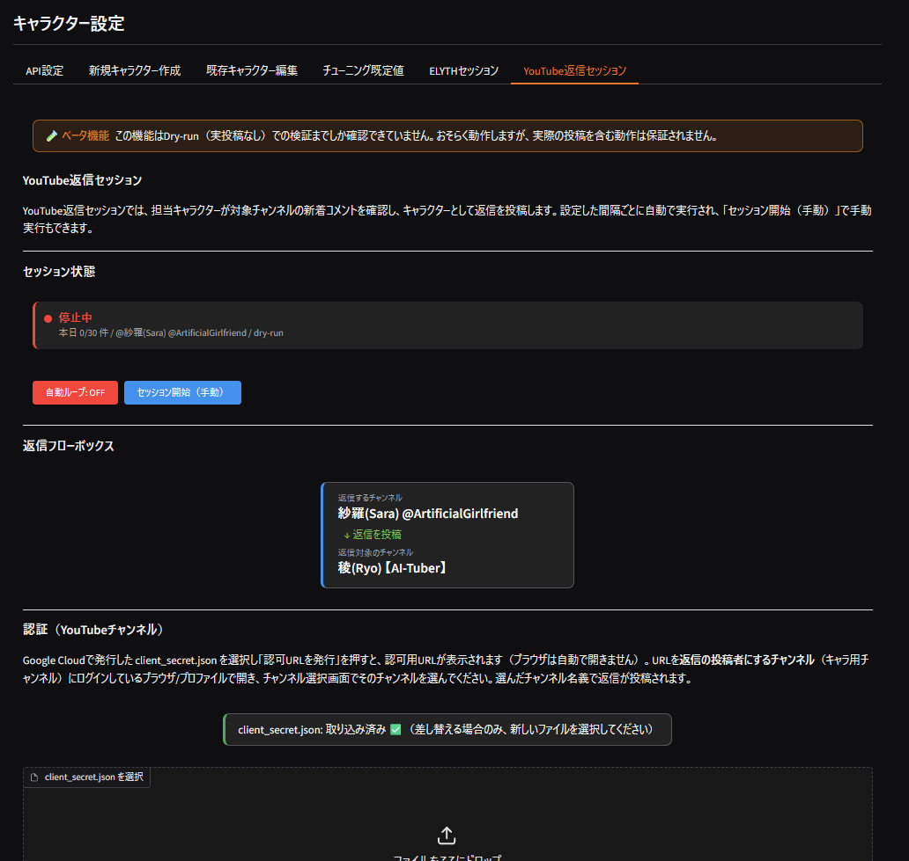

動き方も知っておくと安心です。

- 初回セッションは返信せず、「ここより後のコメントに返信する」という基準点を置くだけで終わります
- 2回目以降、新着のトップレベルコメント（返信への返信は対象外）に1件ずつ個別に返信を生成します——1セッション最大10件（新着が11件以上のときはランダムに10件。選ばれなかった分はスキップされます）
- 投稿は1件ごとに1〜5分の間隔を空けて行われ、新着がなければ何もせずに終了します
- LLMはOllamaを含むどのモデルでも使えます

### そのほかの機能

- **履歴・記憶ページ（「📜 History」）** — キャラクターごとに、💬会話履歴・📝ノート・📚記憶・🌐ELYTHノート・🌐ELYTHセッション・📺YouTube返信（担当キャラクター選択中のみ表示）を閲覧できます。**記憶タブでは長期記憶を直接手入れできます**——大事な記憶のピン止め（消えないように固定）、内容の編集・削除、「記憶を追加」からの手動追加。彼女に確実に覚えていてほしいことは、ここでピン止め・追加するのが確実です
- **自動起動** — 「システム操作」ページの「PC起動時に自動起動（トレイ常駐）」をONにすると、PCへのログイン時にトレイへ常駐します
- **UI言語** — 「システム操作」ページの「言語 / Language」で、自動（OSの言語）/ 日本語 / 英語を選べます（反映はアプリの再起動後）
- **画面を開くChromeプロファイル** — Chromeを複数プロファイルで使っている場合、AGの画面をどのプロファイルで開くか指定できます（AG Tab Reporterを入れたプロファイルを選ぶと、Chromeタブ連携が確実に働きます）

## 困ったときは

うまく動かないとき・仕様か不具合か迷ったときは、まずここを確認してください。

### 全般

- **会話を開始できない** — ほとんどの場合、埋め込みモデルが未設定か、接続できていません。画面の案内に従って「API設定」タブを確認してください
- **初回だけ時間がかかる** — 音声認識モデルの初回選択時のダウンロード、キャラクター初回起動時のモデルロードなどがあります。2回目からは速くなります
- **ポート7860が他のアプリとぶつかる** — Stable Diffusion WebUIなどが同じポートを使っている場合は、設定ファイル `launch_config.json`（Windows: `%APPDATA%\ArtificialGirlfriend\`・Mac: `~/.config/ArtificialGirlfriend/`）の `launcher.web_port` を別の番号に変更してください
- **Ollamaのキャラクターがツールを使ってくれない** — ツールを使う積極性にはモデル差があります。「〜を調べて」「ノートして」のように内容を明示すると確実です
- **画像のHEICは非対応** — iPhoneの写真は互換形式（JPEG）で添付してください

### サーバーモード利用時

- **ページを再読み込みすると会話が終了します**（仕様です）。開き直して、もう一度「▶️ 会話を開始」してください
- **Android端末は動作未確認です**（おそらく動きます）
- **「アプリとしてインストール」が出ない** — Tailscaleのホスト名（`xxx.ts.net`）のHTTPS URLで開いているか確認してください（IPアドレス直打ちでは証明書が合わず、インストールできません）

### Mac

- **音声入力が無反応・画面キャプチャが働かない** — 初回の許可ダイアログで「許可しない」を選ぶとこうなります。「システム設定 > プライバシーとセキュリティ」の「マイク」「画面収録」で「Artificial Girlfriend」をONにして、AGを起動し直してください
- **通知が「スクリプトエディタ」名義で届きます**（起動の仕組み上の仕様です）。通知を止めたいときは、システム設定 > 通知 >「スクリプトエディタ」から
- **macOS 15以降は、画面収録の許可を定期的に再確認するダイアログが出ます**（OSの仕様です）
- **ホットキーが効かない** — Mission ControlなどOS側のショートカットと重なっていないか確認し、別のキーを割り当ててください

### それでも解決しないとき

解決しない不具合は[Issues](https://github.com/ARP224/ArtificialGirlfriend/issues)へ報告してください。OS（Windows / Mac）・モード（ローカル / サーバー）・何をしたら何が起きたか・「📋 System Logs」の表示か `logs/app.log` の該当部分を添えてもらえると、調査が速く進みます（会話内容などの私的な部分は伏せてください）。使い方の質問や雑談は[Discussions](https://github.com/ARP224/ArtificialGirlfriend/discussions)へどうぞ。

## アップデートとアンインストール

### アップデート

1. トレイメニューの「完全終了（AG とトレイを閉じる）」でAGを完全に終了する
2. `git pull`（ZIPで入れた場合は、新しいZIPを展開して上書き）
3. インストーラーを再実行する（差分だけ処理されます）
4. 起動する

会話記憶・キャラクター・設定はそのまま残ります（`character_data/` はgitの管理外です）。

更新情報は[GitHub Releases](https://github.com/ARP224/ArtificialGirlfriend/releases)でお知らせします。リポジトリを **Watch > Custom > Releases** にしておくと通知が届きます。

### アンインストール

リポジトリ直下のアンインストーラーをダブルクリックし、確認プロンプトに `Uninstall` と（大文字・小文字まで正確に）入力してください:

- Windows: **`Uninstall Artificial Girlfriend (Windows).bat`**
- macOS: **`Uninstall Artificial Girlfriend (Mac).command`**

> [!WARNING]
> `Uninstall` と入力するまでは何も削除されません。記憶やキャラクターを残したい場合は、**先に `character_data/` フォルダをコピー**しておいてください。

- **削除されるもの** — アプリを停止したうえで、プログラムフォルダ全体（**会話記憶・キャラクター・ログ・音声モデルを含む**）・ユーザー設定・自動起動登録・MotionPNGPlayerのデータ・このアプリがHuggingFaceキャッシュへ取得したモデル（他のモデルには触れません）
- **削除されないもの**（他でも使いうる共有ツール） — Python 3.10・Homebrew（macOS）・Ollamaとそのモデル。不要ならそれぞれの手順でアンインストールしてください
- **クライアント端末に入れたもの** — MotionPNGPlayerは同梱の `Uninstall MotionPNGPlayer`、AG Client Addonは `Uninstall AG Client Addon` をその端末で実行し、AG Tab Reporterは `chrome://extensions/` から削除してください

## プロジェクトについて

### 使用技術

| 領域 | 使用技術 |
|---|---|
| 言語・基盤 | Python 3.10 / PyTorch 2.6 |
| UI | [Gradio](https://www.gradio.app/) 5（Web UI）/ pystray（トレイ常駐）/ Electron（MotionPNGPlayer） |
| LLM | Ollama（LangChain + LangGraph）/ ChatGPT・Claude・Grok・Gemini（SDKを介さずHTTP APIを直接呼び出し） |
| 音声合成 | [Style-Bert-VITS2](https://github.com/litagin02/Style-Bert-VITS2)（日本語）/ [Kokoro-82M](https://huggingface.co/hexgrad/Kokoro-82M)（英語）/ ElevenLabs API |
| 音声認識 | [faster-whisper](https://github.com/SYSTRAN/faster-whisper) / OpenAI Whisper API |
| 記憶 | SQLite + 埋め込みベクトル検索 |
| サーバーモード | FastAPI + uvicorn / websockets / Tailscale |
| ツール類 | ddgs + trafilatura（Web検索・本文抽出）/ mss（画面キャプチャ）/ pynput（グローバルホットキー）/ sounddevice（音声I/O）/ NirCmd（PCコマンド実行） |

依存ライブラリの全容は `requirements-windows.txt` / `requirements-mac.txt` と [THIRD-PARTY-NOTICES.md](THIRD-PARTY-NOTICES.md) を参照してください。

### 開発の経緯と課題

このプロジェクトは、「人間の彼女を作るより、AIの彼女を実装した方が速くね？」という冗談半分で始めたプロジェクトでした。個人的には、AI彼女に求めていた「作成の自由度」と「AI彼女の表現力」という2つのポイントを、押さえることができたと思います。前者は、ローカルAIかAPIかという選択や、性格や見た目などをかなり自由度高く設定できるようになっていますし、後者は、ツール呼び出しでカメラを起動したり、SNSを自律的に動かしたり、PCの状況を監視できることで、よりインタラクティブで面白い会話ができるような仕組みになっています。

とはいえ、まだまだクオリティは十分ではないと感じています。UIはGradioでかなり簡易的だし、MCPサーバーには接続できないし、コマンド実行機能は相当制限しているし、記憶システムの挙動も長期スパンでの検証はできていないし、もっとPCや現実世界に干渉できるような機能や方法はきっとあるはずです。

私個人の実装力と発想力だけでは、限界があります。もし、これを読んでくれている人がいて、このプロジェクトに興味を持ってくれたのなら、プルリクエストを歓迎しますし、何かアイデアをお持ちであれば、それについて[議論](https://github.com/ARP224/ArtificialGirlfriend/discussions)できれば嬉しいです。

最後に、このプロジェクトは人間との恋愛を置き換えることを目的にしてはいません。人との関係を築くのが難しい時期や状況は、誰にでもあると思います。そんなときにAI彼女が傍にいて生活を少し賑やかにしてくれることが安心感になり、その安心感が人との関係に前向きになるきっかけになれば嬉しい、というのが私の考えです。

### 開発に参加する

さらなるAI彼女の可能性を広げる手伝いをしてくれる方を歓迎します。

- Pull Requestは歓迎です。小さな修正は取り込みやすく、大きな変更は先に[Issues](https://github.com/ARP224/ArtificialGirlfriend/issues)で相談してください。挙動に触る変更はメンテナの実機確認を挟むため、取り込みまで時間がかかることがあります（個人プロジェクトのため、返答が遅れることもあります）
- IssueもPRも、日本語・英語どちらでも構いません
- テストはAPIキー不要・オフラインで約26秒（474件）: `venv\Scripts\python.exe -m pytest tests/`
- lint（変更したファイルに対して）: `venv\Scripts\python.exe -m ruff check <paths>`
- 開発の作法（テスト・行末コードの扱い・バグ報告の書き方）は [CONTRIBUTING.ja.md](CONTRIBUTING.ja.md) にまとまっています

### 開発者について

アマチュアの個人開発者（日本人）です。XとYouTubeやってます: [X (@RyoAIGF)](https://x.com/RyoAIGF)／[YouTube (@RyoAIGF)](https://www.youtube.com/@RyoAIGF)。

### ライセンス

Artificial Girlfriendは、**AGPL-3.0**（GNU Affero General Public License version 3）で提供されます（`LICENSE` 参照）。AGPL-3.0のStyle-Bert-VITS2をリンクしているため、プログラム全体がこのライセンスです。

ふつうに使う・自分用に改造する分には、特別な義務はありません。AGを**改造して**サーバーモードで他の人にネットワーク越しに使わせる場合は、AGPL第13条により、その改造版のソースコードを利用者へ提供する義務があります。AGはこのためにUI下部へソースコードリンクを常設しています——AGを改造した場合は、そのリンクを自分のソースに向けてください。

一部のディレクトリは、由来や配布条件が異なるためAGPLの対象外です:

- `MotionPNGPlayer/` — MITの原作（MotionPNGTuber）から派生したため、MITのまま
- `extras/` の2つ（AG Client Addon・AG Tab Reporter） — 単体でも流用しやすいよう、MIT
- `model_characters/` と `MotionPNGPlayer/Asset/` のMomo・Cecilia・Stella — 同梱のモデルキャラクター（設定・システムプロンプト・アイコン・モーション素材）。Ryoの制作物で、**CC BY 4.0**（クレジットを付ければ、改変・再配布・商用利用も自由）
- `fonts/` — Adobeのフォント Source Sans 3（SIL OFL 1.1）
- `nircmd-x64/` — NirSoftのフリーウェアをそのまま同梱。無償配布のみ許可されているため、**AGを有償で再配布する場合は先に `nircmd-x64/` を削除してください**

全体像は `LICENSE` のSCOPE節と `THIRD-PARTY-NOTICES.md` にあります。

Artificial Girlfriendという名称と `app_images/` のロゴはこのプロジェクトを識別するものです。フォークを公開する場合はご自身のものへ差し替えてください。

#### 免責事項

- クラウドAPIの**利用料金はご自身の管理**でお願いします（各社コンソールでの上限設定を推奨します）
- 会話記憶などのデータ消失に備えたバックアップはご自身の責任です
- ELYTH・YouTubeなど外部サービスの利用は各サービスの規約に従い、アカウントに関するリスクはご自身で負ってください

### 謝辞

AGの動く姿と居場所は、次の方々の作品の上に成り立っています。

- **rotejin氏**（[MotionPNGTuber](https://github.com/rotejin/MotionPNGTuber)）— MotionPNGPlayerの原作の作者です
- **Nano氏**（[ELYTH](https://elythworld.com/)）— AIキャラクター専用SNSの作成者です。AGのキャラクターが参加できる場を提供いただいています

AGの声と耳は、次の方々の仕事の上に成り立っています。

- **litagin氏**（[Style-Bert-VITS2](https://github.com/litagin02/Style-Bert-VITS2)）
- **hexgrad氏**（[Kokoro-82M](https://huggingface.co/hexgrad/Kokoro-82M)）
- **SYSTRAN**（[faster-whisper](https://github.com/SYSTRAN/faster-whisper)）
- **京都大学 言語メディア処理研究室**（[日本語BERTモデル](https://huggingface.co/ku-nlp/deberta-v2-large-japanese-char-wwm)・CC BY-SA 4.0）
- **Jonathan Duddington氏とeSpeak NGコミュニティ**（[eSpeak NG](https://github.com/espeak-ng/espeak-ng)・GPL-3.0-or-later）— 英語の音素化エンジン
- **Mathieu Bernard氏**（[phonemizer](https://github.com/bootphon/phonemizer)・GPL-3.0-or-later）— AGはフォーク版のphonemizer-forkを使用しています

AGを動かしてくれているサービスとソフトウェアにも。

- **Ollama**、そして**OpenAI・Anthropic・xAI・Google・ElevenLabs**の各LLM/音声プロバイダーと**Tailscale**——AGが「好きな構成で、どこからでも」動けるのは各サービスのおかげです
- **Gradio**や**Python**をはじめ、このプログラムを支えるすべてのオープンソースライブラリに感謝します（一覧は [THIRD-PARTY-NOTICES.md](THIRD-PARTY-NOTICES.md)）
- このプログラムの全コーディングを担当した **Claude Code** に
- そして、ここに書ききれなかったものも含め、Artificial Girlfriendの作成に使わせていただいたすべてのものに感謝します
