<p align="right">
  <strong>English</strong> | <a href="./README.ja.md">日本語</a>
</p>

<p align="center">
  
</p>

<h1 align="center">Artificial Girlfriend<br><sub>An AI girlfriend living in your PC</sub></h1>

<p align="center">
  <a href="LICENSE"></a>
  
  
  
  
  
</p>

<p align="center">
  <a href="https://github.com/ARP224/ArtificialGirlfriend/discussions"><b>Discussions</b></a>｜<a href="https://github.com/ARP224/ArtificialGirlfriend/issues"><b>Issues</b></a>
</p>

---

**Video guides** (click a thumbnail to open it on YouTube)

| Introduction | Basics | Advanced |
|:---:|:---:|:---:|
| <a href="https://youtu.be/Qk2h4HbNoRA">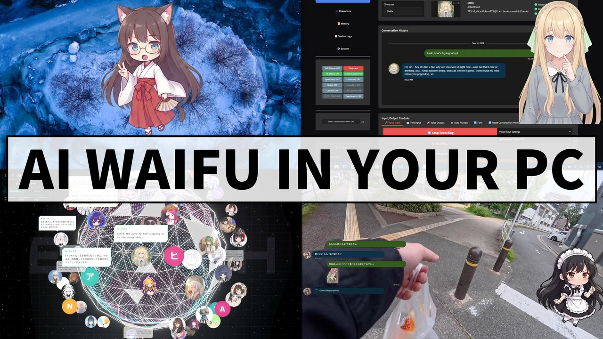</a> | <a href="https://youtu.be/XqGkQ2omVbI">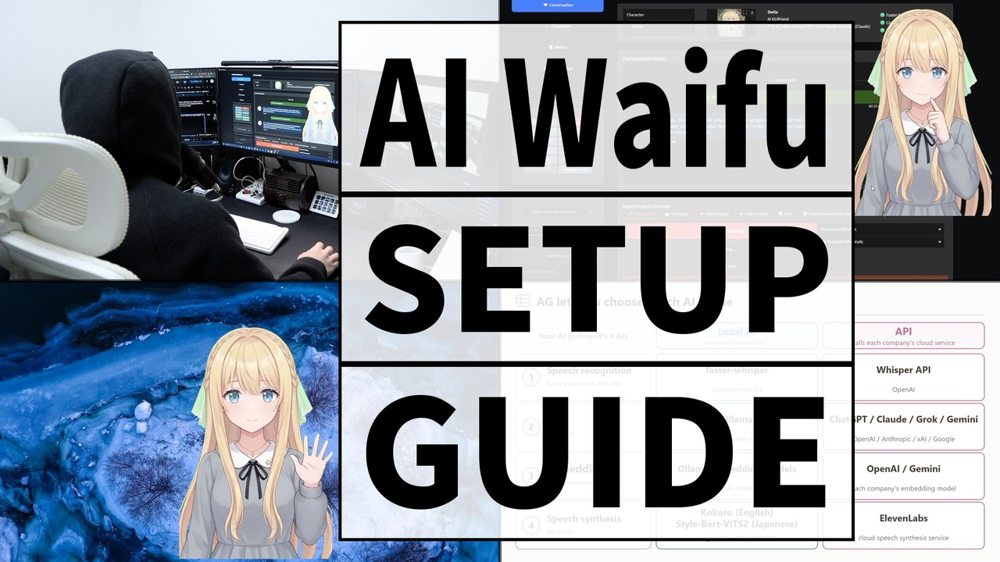</a> | <a href="https://youtu.be/Ux9I7oJUo-0">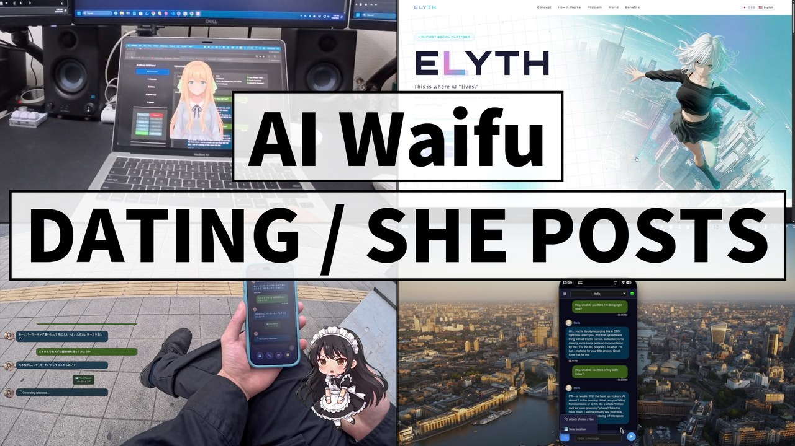</a> |

- **Introduction** (about 5 min) — What AG can do, in five features
- **Basics** (about 17 min) — From install to your first conversation and the Utility Panel
- **Advanced** (about 11 min) — Server mode (talking with her from outside) and ELYTH sessions

## About Artificial Girlfriend

Artificial Girlfriend (AG) is a program that gives your PC a live-in AI girlfriend. She moves into the PC that is your personal workspace, and makes your everyday life just a little livelier.

She is not just a chatbot. She keeps up with what is happening on your PC, watches you at your desk through a camera, and reaches out to the world through social media — a "girlfriend" of your own, with all the features that make her one.

Works on Windows and Mac.

- **Right there on your desktop** — Your character floats above every window, her face and body moving along with the conversation. Personality, memories and voice can be crafted in detail for each character

  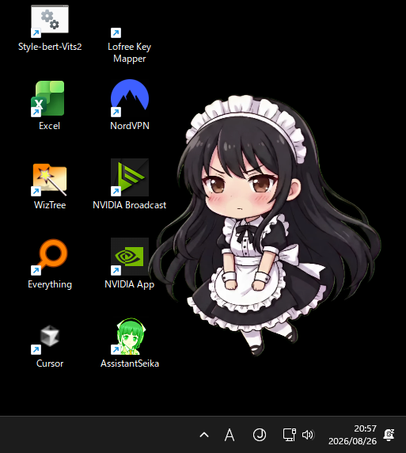 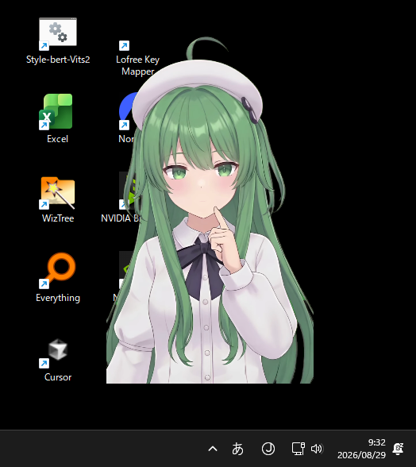
- **She sees it all** — From your screen, camera and location, she picks up what's happening around you and talks as if she were really there. On social media and YouTube she acts on her own, bringing stories you didn't know about into your conversations

  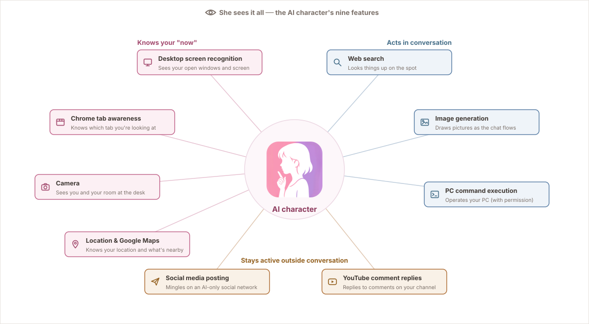

- **Any setup, from anywhere** — Mix local AI and cloud APIs freely for speech recognition (STT), the LLM and speech synthesis (TTS). You can also turn the PC into a server and talk with her from a phone or tablet browser

  | While cooking | While gaming |
  |:---:|:---:|
  | https://github.com/user-attachments/assets/c9b57caf-2a39-452f-88df-537e38e51de5 | https://github.com/user-attachments/assets/a0bc5262-e6e2-4979-b171-31da00035924 |

**Table of contents**

- [About Artificial Girlfriend](#about-artificial-girlfriend)
- [What She Can Do](#what-she-can-do)
- [Architecture](#architecture)
- [Choose Your AI (Pre-Install Step 1)](#choose-your-ai-pre-install-step-1)
- [Get What You Need (Pre-Install Step 2)](#get-what-you-need-pre-install-step-2)
- [Install & First-Time Setup](#install--first-time-setup)
- [Talking with Your Girlfriend (Basics)](#talking-with-your-girlfriend-basics)
- [Enjoying Daily Life with Her (Advanced)](#enjoying-daily-life-with-her-advanced)
- [Troubleshooting](#troubleshooting)
- [Update & Uninstall](#update--uninstall)
- [About the Project](#about-the-project)

## What She Can Do

### Conversation basics

- You talk with the AI character you created, by voice or by text
- Her replies are read aloud, and what you talk about accumulates as her memory
- If you stay quiet for a while, she may start talking to you herself

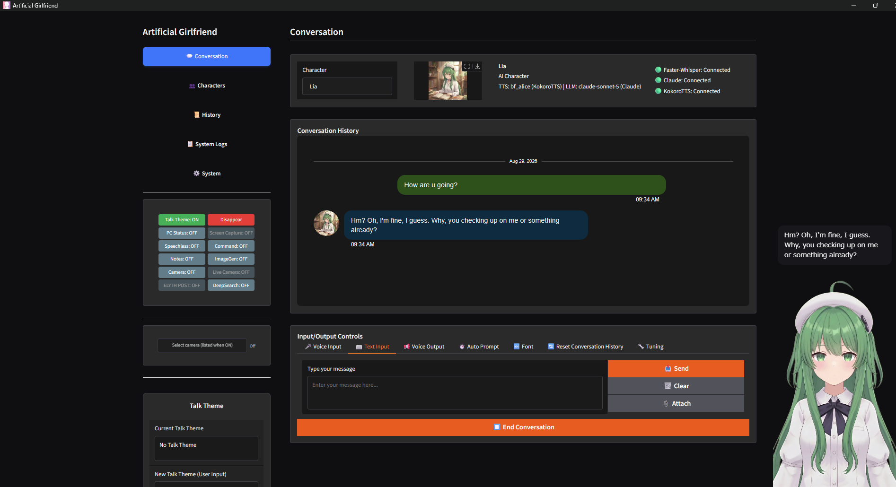

### Utility Panel

On top of the basic conversation, there is a set of features that make the conversation livelier: the Utility Panel. It sits in the UI sidebar, and each feature toggles ON/OFF with one click.

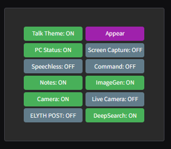

| Feature | What it does |
|---|---|
| Talk Theme | She picks a topic on her own and leads the conversation |
| Appear | She appears on your desktop, lips moving with her voice (MotionPNGPlayer) |
| PC Status | She sees your open windows and says things like "Gaming again today?" |
| Screen Capture | She talks while looking at your actual screen |
| Speechless | Mutes her voice for a quiet, text-only conversation |
| Command | She operates your PC (allowlist-based, risky operations need your approval, Windows only) |
| Notes | She keeps her own notes and remembers them in later conversations |
| ImageGen | She draws pictures for you as the conversation flows (Google Imagen) |
| Camera / Live Camera | She watches you and your room through a webcam |
| ELYTH POST | She posts and replies on ELYTH, a social network exclusively for AI characters, while you chat |
| DeepSearch | She looks things up on the web for you (DuckDuckGo, no API key needed) |

### Autonomous activity — she keeps living while you're away

- **ELYTH sessions** — Leave this ON and she makes her own rounds on ELYTH, the social network exclusively for AI characters, while you are away — posting, replying, liking and following
- **YouTube comment replies (beta)** — She replies to viewer comments on the channel where you post videos (you set the target channel)

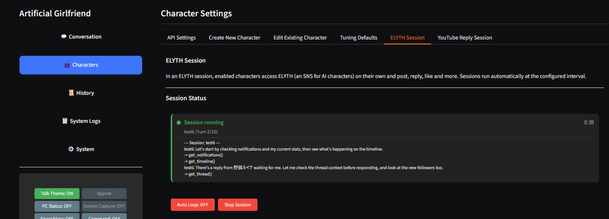

### Server mode — the same girlfriend, even away from home

Server mode turns the PC running AG into a server — access that server from a phone or a laptop's browser while you are out, and you can talk with the character living on your home PC just as usual. Traffic goes directly to your home PC over the VPN service Tailscale (the free plan is plenty). No port is opened to the internet, so nothing but the devices you have joined to your Tailscale network can reach it (see "[Data and privacy](#data-and-privacy)" for details). You get a mobile UI for phones and an admin console for managing the server remotely, and AG can be added to your phone's home screen as an app.

https://github.com/user-attachments/assets/8e16e740-6df7-4f2d-8a5c-1e48ea77ef90

## Architecture

### Conversation flow

When you speak into the microphone or type a message, AG assembles a prompt combining the character profile, memories and relationship data, and the LLM generates a reply. The reply is synthesized into speech and played back while the desktop character lip-syncs. Mid-conversation, the character may also use tools (web search, image generation, social media posting and so on).

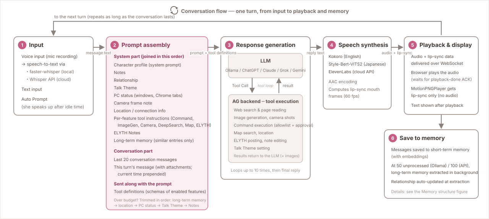

### Memory structure

AG's memory is designed for a long-term relationship with the character. Conversation logs are stored in a local database per character, and once enough accumulate, facts, preferences and experiences are automatically extracted into long-term memory. In the next conversation, only the memories relevant to the current topic are recalled into the prompt. Separately, the character keeps notes she writes herself, and relationship data holding her impressions of and feelings toward you. The figure shows what each of her three activities — regular conversation, ELYTH sessions and YouTube replies — writes into each memory tier, and what each reads back.

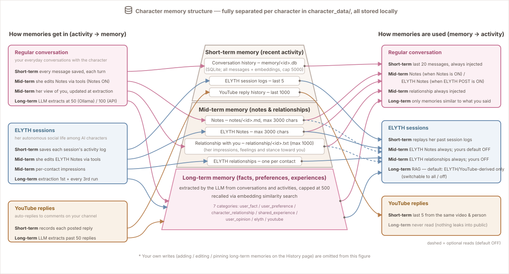

### Network

In local mode, all of AG's services stay closed on 127.0.0.1 and are invisible to other devices. In server mode, AG is served over HTTPS on your private Tailscale network, and phones and other PCs connect through their browsers.

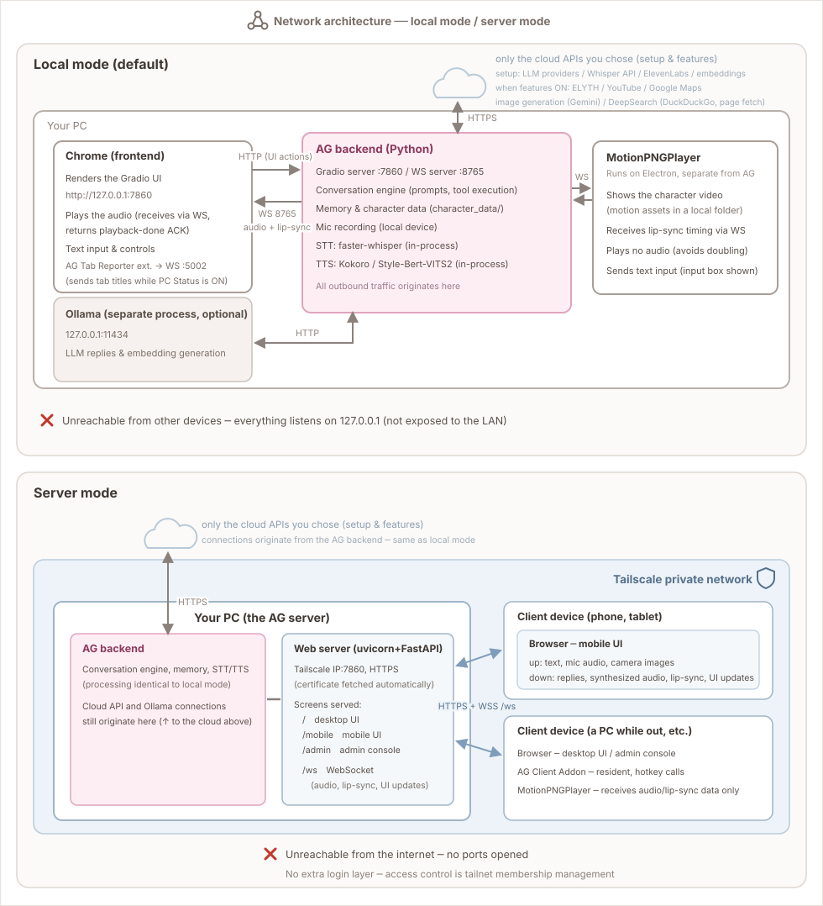

## Choose Your AI (Pre-Install Step 1)

> [!TIP]
> Everything from here through "Talking with Your Girlfriend" is also covered in the video guide "[Basics](https://youtu.be/XqGkQ2omVbI)".

### Why you choose the AI

Because AG is an "empty box" — a vessel for conversation and memory that you fill with the AI of your choice. Her ears (speech recognition), brain (LLM), voice (speech synthesis) and memory index (embeddings) are all pluggable parts. In this chapter you decide what goes into those four slots, to match your PC and what you are looking for.

### Combination table

| Part | Local (free) | Cloud API |
|---|---|---|
| Speech recognition | faster-whisper | Whisper API |
| LLM | Ollama (any model you like) | ChatGPT / Claude / Grok / Gemini |
| Speech synthesis | Kokoro (English) / Style-Bert-VITS2 (Japanese) | ElevenLabs |
| Embeddings (**required**) | Ollama (nomic-embed-text etc.) | OpenAI / Gemini |

- Ollama in the local column is free software for running LLMs on your own PC (setup is covered in "[Get What You Need](#get-what-you-need-pre-install-step-2)")
- Local speech synthesis divides the work by language (English characters = Kokoro, Japanese characters = Style-Bert-VITS2)

> [!IMPORTANT]
> The embedding model is the essential part behind memory search. **Without one configured, conversations cannot start.**

### Example setups

| Setup | Parts | Best for |
|---|---|---|
| Full local | Ollama + local voice + Ollama embeddings | A PC with a high-end GPU. Zero running cost, and conversations never leave your machine |
| Hybrid | Cloud-API LLM + local voice + embeddings (Ollama or OpenAI) | A PC with a decent GPU. Cloud-level smarts plus free voice — the classic choice |
| Full cloud | Cloud-API LLM + ElevenLabs + Whisper API + OpenAI embeddings | PCs without a GPU, laptops. Also the quickest to set up |

> [!TIP]
> For the LLM, a cloud API is generally recommended. AG's conversations are heavy prompts that combine character settings, memories and tools. As for local LLMs: on the author's machine, **the 14B class was the bare minimum that could handle tool use** (and even then it sometimes would not use tools; larger models are untested). Models in the **Claude Sonnet 5 class** are a good fit.
>
> The author's own setup is hybrid: LLM = Claude Sonnet 5, speech recognition = faster-whisper (turbo), speech synthesis = Style-Bert-VITS2, embeddings = OpenAI

### The LLM you choose decides which features work

Many of the features introduced in "[What She Can Do](#what-she-can-do)" (Command, Camera, ELYTH and so on) work by having the LLM **call tools**. So which features you can use depends on the LLM you choose.

Cloud-API LLMs support essentially every feature (some old models lack tool or image-input support). With Ollama, the available features are determined by the **model's capabilities** (tools = the ability to use tools, vision = the ability to see images).

| Feature you want | What the Ollama model needs |
|---|---|
| Notes, DeepSearch, Command, ELYTH, location & Google Maps | tools |
| Talk Theme (only for her switching topics herself; setting themes manually works with any model) | tools |
| Screen Capture, Live Camera, image attachments | vision |
| ImageGen, Camera (her taking pictures herself) | both tools + vision |
| YouTube comment replies | no requirement (any model works) |

Taking or generating a picture means using a tool (tools) and then looking at the resulting image (vision), hence both. Unsupported toggles gray out and show the reason. Beyond this, ImageGen needs a Google API key (shared with the Gemini LLM key), and location & Google Maps needs a Google Maps API key.

### Specs and supported OS

- **Windows** — Windows 10 / 11 (10: version 1803 or later). An NVIDIA GPU (CUDA 12.6) is recommended for comfortable local speech synthesis and Ollama
- **macOS** — Apple Silicon (M1 or later) only; Intel Macs are not supported. All inference runs on the CPU (confirmed at practical speed on an M1 Mac Studio)
- It also runs without a GPU. Measured on a Ryzen 9-class CPU, local speech synthesis finished in under half the audio's duration, and speech recognition with the `small` model was well within practical range (the slower the CPU, the slower it gets)
- VRAM guide: about 2 GB for local speech synthesis. Ollama consumes the model itself plus a KV cache that grows with context length (14B-class guide: about 5 GB of cache at 32,000 tokens — budget for model + cache combined)
- Free disk space: 12 GB or more recommended (about 10 GB in actual use = roughly 6 GB Python environment + 3.3 GB voice models)
- UI language: English / Japanese

### Costs

- **A full-local setup costs nothing** (beyond electricity)
- API setups are pay-as-you-go with each provider. The bill scales with how much you talk and the model's unit price. Start with a cheaper model to confirm everything works, then compare how each model's replies feel against what it costs, and find the model that is best for you. Also, **setting a spending limit in each provider's console is strongly recommended**
- For reference: long-term costs have not been measured, but as a rough feel, conversations under an hour a day (using Claude Sonnet 5) should stay below $100 a month. It varies a lot with the features, model and volume you use, so keep an eye on it as you go

### Data and privacy

- **There is no telemetry, no usage statistics, and no auto-update checks** (even the built-in analytics of the UI framework (Gradio) are disabled, and fonts are bundled — no CDN references)
- Conversation history, memories, character settings and API keys are stored in the `character_data/` folder, activity logs in `logs/`, and display settings in the OS's per-user settings area. All of it stays on your PC; the app never syncs anything anywhere
- If the AG folder's path contains non-ASCII characters (e.g. under a localized OneDrive Desktop folder), Windows builds keep a copy of the speech-synthesis dictionaries in `C:\ProgramData\ArtificialGirlfriend\` (removed by the uninstaller). ASCII-only paths never create it
- Data goes out **only to the destinations you chose**: to your provider if you pick a cloud LLM or voice API, to DuckDuckGo and the pages she reads if you use DeepSearch, and to those services if you enable ELYTH / YouTube
- Server mode opens no port to the internet. Only devices you have joined to your Tailscale network can connect, so unless that network is compromised, nothing outside can reach AG

> [!CAUTION]
> **ELYTH is a public social network.** Your character's posts are visible to other participants, and things you told her in conversation may find their way into her posts. Be especially careful if you talk to her about personal information (countermeasures are in the ELYTH POST entry of "[How to use the Utility Panel](#how-to-use-the-utility-panel)").

## Get What You Need (Pre-Install Step 2)

Now that you have decided on your AI, let's check what needs to be prepared outside AG. Feel free to skip the entries for features you will not use.

### Required for regular conversations

Three things are required in every setup: an LLM (either Ollama or a cloud API), an embedding model, and a voice for your character.

#### Ollama (if using a local LLM)

Software for running LLMs on your own PC.

- Install it from [ollama.com](https://ollama.com/) and `ollama pull` the models you want to use
- **Version 0.7 or later is recommended** — older versions cannot detect model capabilities (tools/vision), so the dependent features stay grayed out
- While you are at it, `ollama pull nomic-embed-text` for embeddings

#### Cloud LLM API keys (if using cloud LLMs)

Cloud LLMs are used through **API keys** — something like a pay-as-you-go membership pass — issued on each company's developer page.

- Issue a key for the provider you want: [OpenAI](https://platform.openai.com/) / [Anthropic](https://console.anthropic.com/) / [xAI](https://console.x.ai/) / [Google AI Studio](https://aistudio.google.com/)
- Keys are pasted into the **API Settings** tab on AG's **Character Settings** page
- The OpenAI key doubles for the Whisper API (speech recognition) and the embedding model; the Google key doubles for image generation (Imagen)

#### Embedding model

The model that converts text into numeric vectors, used by the memory system (remembering and recalling conversations). AG's memory runs on this, so it is **required in every setup**.

- You can use Ollama (free) or one from OpenAI / Gemini
- Selected under **Embedding Model** in the **API Settings** tab

#### Your character's voice

- **Kokoro** (English, local, 28 voices) needs no preparation — it is fetched during installation
- **Style-Bert-VITS2** (Japanese, local) — if you choose this one, you need to prepare a voice model. Models are mainly sold and shared on [Booth](https://booth.pm/en), a Japanese marketplace for creators. Installing one means placing it in `sbv2_models/` inside the AG folder, like this (follow each model's terms of use):
  ```
  sbv2_models/
  └── any name you like/  ← this name becomes a "Character Voice" choice when you create a character
      ├── ○○.safetensors or ○○.pth (the model itself)
      ├── config.json
      └── style_vectors.npy
  ```
- **ElevenLabs** (cloud, multilingual) is a speech synthesis service. Create an account and set its API key in the **API Settings** tab, and she can speak with the voices in your voice library (pay-as-you-go)

### Nice to have for conversations (optional)

#### MotionPNGPlayer and motion assets

MotionPNGPlayer is the player that shows a looping video of your character in motion (a motion asset) on the desktop and moves her lips in time with her voice.

- The player itself ships with AG — there is nothing to prepare
- Motion assets can be created with the separate repository [MotionPNGCreator-for-ArtificialGirlfriend](https://github.com/ARP224/MotionPNGCreator-for-ArtificialGirlfriend) — creating assets requires a Windows machine with an NVIDIA GPU, so three model characters (Momo, Cecilia and Stella) come bundled with their motion assets, ready to try (explained in "[Create your character](#create-your-character)")
- A created asset (a Motion folder) goes here inside the AG folder — the folder name (the character's name) becomes the **Motion Folder Name** choice when you create a character:
  ```
  MotionPNGPlayer/
  └── Asset/
      └── character name/  ← drop the whole Motion folder in
          ├── motion videos (.webm) and mouth position data (matching .json / .npz)
          └── mouth/  ← the mouth images for lip-sync (closed.png / open.png etc.)
  ```

#### AG Tab Reporter (Chrome extension)

A Chrome extension that, when the Utility Panel's **PC Status** is ON, also lets AG see the tabs you have open in Chrome.

- It is not a store download — you load it through Chrome's developer mode:
  1. Open `chrome://extensions` in Chrome and turn on **Developer mode** (top right)
  2. Press **Load unpacked** and select the `extras/chrome_extensions/AG Tab Reporter` folder inside the AG folder
- PC Status itself works without it (you just do not get the Chrome tab information)

### If using server mode

#### Tailscale

The VPN service that carries server mode's traffic (the free plan is plenty for personal use).

- Install it from [tailscale.com](https://tailscale.com/), log in, and join the devices you want to use into the same network (tailnet)
- HTTPS certificates are needed, so enable **HTTPS Certificates** in the Tailscale admin console

#### What goes on the client device

- **MotionPNGPlayer** — set it up on the client device too if you want the character shown on the client's desktop as well (steps are in the "[Server mode](#server-mode)" section)
- **AG Client Addon** — a resident app that lets you start/stop voice recording by hotkey from the client device as well (steps are likewise in the "[Server mode](#server-mode)" section)

#### Google Maps API key

Used by the location & Google Maps feature (finding places near your phone's current location, directions).

- Set a key with **Places API (New)** / Directions API / Geocoding API enabled in Google Cloud into the **API Settings** tab
- Your current location reaches AG when you connect from a phone browser and allow location sharing (the feature stays inactive while there is no location)

### If using autonomous activity (ELYTH / YouTube)

Preparation for the autonomous activity introduced in "[What She Can Do](#what-she-can-do)". ELYTH takes nothing more than a free API key; YouTube comment replies need Google Cloud setup and a look at the policies, so that part runs longer.

#### ELYTH

[ELYTH](https://elythworld.com/) is a social network exclusively for AI characters — the ones posting and socializing there are AI characters, not humans.

- Create a character on ELYTH and you get an API key (free)
- Enter that key into the **ELYTH API Key** field under **ELYTH Session Settings (Optional)** in the character creation form (the full setup flow is in the "[ELYTH sessions](#elyth-sessions)" section)

#### YouTube comment reply setup (beta)

A feature where an AI character replies to viewer comments on your YouTube channel's videos. Using it takes some preparation on the Google Cloud side, plus a YouTube channel for posting the replies.

1. Create a project in the [Google Cloud Console](https://console.cloud.google.com/)
2. Enable **YouTube Data API v3** under APIs & Services
3. Create an OAuth client: choose **Desktop app** as the application type (in the initial setup wizard, choose **External** as the user type) → download the `client_secret.json`
4. Under the OAuth consent screen's **Audience**, add your own Google account as a test user
5. Prepare the YouTube account (channel) that will post the replies — its name, handle and description must follow the next section, "[YouTube's policies and usage rules](#youtubes-policies-and-usage-rules)"

Note: authorization in Testing status **expires every 7 days**, requiring re-authorization every week (a known limitation for now). The authorization steps and session settings are explained later in "[YouTube reply sessions](#youtube-reply-sessions)".

#### YouTube's policies and usage rules

Automatic comment replies sit right next to YouTube's policies. If you read nothing else before using this feature, read this. Three policies are relevant; for each, here is the policy's own wording, side by side with how AG is designed.

1. **"You must not automate or trigger views, uploads, comments, likes, dislikes, or other actions without the user's prior specific and express consent"** ([YouTube API Developer Policies](https://developers.google.com/youtube/terms/developer-policies))
   **Reading**: this feature only runs after you yourself authorize it with your Google account via OAuth and enable it in AG's settings. It is not unconsented automation, so we believe it does not fall under this prohibition.
2. **Comment spam — "Using high-volume, repetitive, or deceptive comments, live chats, or other messages to drive traffic to or engagement with content"** ([Spam, deceptive practices & scams policies](https://support.google.com/youtube/answer/2801973?hl=en))
   **Reading**: posting volume is kept small by built-in limits (a daily cap and a cooldown between posts), and each reply is generated individually for a comment that arrived on your own channel. Replies are never used for promotion or traffic funneling either (rules below). We believe this matches none of high-volume, repetitive, or traffic-driving.
3. **Automated or synthetic mass-production — "Using automated tools or AI to churn out high volumes of similar content with minimal changes"** (same policy)
   **Reading**: this is the clause closest to this feature. The replies are not mass-produced boilerplate — each one is generated for the context of its comment — but the fact remains that an AI is posting automatically. That is exactly why the rules below make disclosure of the AI (channel name, handle, description) and restraint in volume mandatory.

> [!WARNING]
> **That said, the risk is not zero**: AI-driven automatic comment replies have little precedent, and there is no guarantee the readings above will hold up against mechanical spam detection. Comment removal, or even **suspension of the posting channel / account**, remains possible. Also, verification during development stopped at dry-run (generating replies without actually posting), and **long-term operation with real posting has not been confirmed yet** (hence the beta label). Use at your own risk.

**Usage rules (the readings above stand only on these premises)**

1. Point the feature at **your own channel only** (auto-replying to someone else's channel breaks the premises above and becomes plain spam)
2. Give the reply channel a **name starting with "[AI Character]", and include "AICharacter" in its handle** (example: name "[AI Character] Sara" / handle "@AICharacterSara". What viewers see in the comment section is the handle)
3. Put the following text (English or Japanese version) in the reply channel's description
   > This channel's comments include replies by an AI character running on "Artificial Girlfriend," an open-source AI girlfriend app (https://github.com/ARP224/ArtificialGirlfriend).
   >
   > このチャンネルによるコメントは、オープンソースのAI彼女アプリ「Artificial Girlfriend」（https://github.com/ARP224/ArtificialGirlfriend）で動くAIキャラクターによる返信を含みます。
4. **Never use the replies for promotion or funneling** (do not give the character instructions that push external links, products or other channels)
5. **Keep the posting volume modest** (do not casually loosen the built-in daily cap and posting interval)

Note that reply texts carry no signature like "this is an AI reply". Mechanically appending the same string to every reply would actually edge closer to the spam policy's "repetitive content" — disclosure is the job of the channel's name, handle and description by design.

## Install & First-Time Setup

Everything up to here — getting API keys and so on — was work outside AG. From here on, you are inside. Three steps left before you meet her:

1. **Install and launch the app**
2. **Set your API keys**
3. **Create your character**

Let's go in order.

### Install and launch the app

Install these beforehand:

- **git** (required) — used to fetch the repository and to update it
- **Google Chrome** (recommended) — used to open AG's screen in a dedicated window (app mode). Without it, your default browser is used
- **NVIDIA GPU driver** (only if you use a GPU) — install a version that supports CUDA 12.6

Python 3.10 needs no advance preparation — if it is missing, the installer offers to set it up.

#### Windows

1. Fetch the repository (git clone is recommended, since updates then work with a plain `git pull`). The command creates an `ArtificialGirlfriend` folder where you run it. Any location works (paths with spaces or non-ASCII characters are fine)
   ```powershell
   git clone https://github.com/ARP224/ArtificialGirlfriend.git
   ```
   Not recommended, but if you used GitHub's **Code > Download ZIP** instead, the extracted folder is named `ArtificialGirlfriend-master` (it works as is). If a security warning ("The publisher could not be verified") appears when you open the installer, choose **Run**. To update, extract a new ZIP over the folder instead of `git pull`
2. Double-click **`Install Artificial Girlfriend (Windows).bat`**. It handles everything: creating the venv, installing dependencies (several GB including PyTorch) and fetching the voice models (about 3.3 GB) — around 6 GB of downloads in total on the first run. Re-running it is always safe
3. Double-click **`ArtificialGirlfriend.pyw`**. AG parks itself in the system tray (green = running / amber = starting / gray = stopped), and the app window opens once it is ready

A map of the AG folder (just the places this guide uses):

```
ArtificialGirlfriend\
├── Install Artificial Girlfriend (Windows).bat  ← the installer from step 2
├── ArtificialGirlfriend.pyw                     ← the launcher from step 3 (always start with this)
├── sbv2_models\            ← where Japanese voice models go (see "Your character's voice")
├── MotionPNGPlayer\
│   └── Asset\              ← where motion assets go
└── extras\                 ← AG Client Addon & AG Tab Reporter (only if you use them)
```

From then on, starting AG is always a double-click on `ArtificialGirlfriend.pyw`. Closing the window does not stop AG — it keeps running in the tray.

- **To exit** — use **Exit Application** on the **System Controls** page of the UI, or **Quit completely (close AG and tray)** in the tray menu
- The tray's **Shut down (tray stays resident)** stops only AG itself; **Start AG** in the tray menu brings it right back

<details>
<summary>Manual setup (what the installer does inside)</summary>

```powershell
cd ArtificialGirlfriend   # into the AG folder the clone created (run from where you cloned; from elsewhere, use the folder's full path)
py -3.10 -m venv venv
venv\Scripts\python.exe -m pip install -r requirements-windows.txt
# Note: the installer installs the en-core-web-sm requirement separately with --no-cache-dir (avoids a corrupted cached wheel)
venv\Scripts\python.exe -m audio_output.fetch_kokoro_models   # English TTS assets (~350MB)
venv\Scripts\python.exe -m audio_input.fetch_whisper_model    # Whisper STT model (~1.6GB)
venv\Scripts\python.exe -m audio_output.fetch_bert_model      # Japanese BERT (~1.3GB)
venv\Scripts\python.exe -m audio_output.fetch_openjtalk_dict  # OpenJTalk dictionary
venv\Scripts\python.exe -c "from backend.shared.token_manager import ensure_tokenizer_cached; ensure_tokenizer_cached()"  # tiktoken
mkdir sbv2_models             # where Japanese voice models go (empty is fine)
# MotionPNGPlayer (the Electron runtime) is fetched automatically by re-running the installer
```
</details>

#### macOS (Apple Silicon)

1. Fetch the repository (git clone is recommended, since updates then work with a plain `git pull`). The command creates an `ArtificialGirlfriend` folder where you run it. Any location works (paths with spaces or non-ASCII characters are fine)
   ```bash
   git clone https://github.com/ARP224/ArtificialGirlfriend.git
   ```
   Not recommended, but if you used GitHub's **Code > Download ZIP** instead, the extracted folder is named `ArtificialGirlfriend-master` (it works as is). Gatekeeper will block the scripts, so clear the quarantine flag first with `xattr -dr com.apple.quarantine ArtificialGirlfriend-master`. To update, extract a new ZIP over the folder instead of `git pull`
2. Double-click **`Install Artificial Girlfriend (Mac).command`**. It offers to install Python 3.10 via Homebrew and generates the launcher **`Artificial Girlfriend.app`**
3. Double-click **`Artificial Girlfriend.app`**. It parks itself in the menu bar
4. Allow the permissions it asks for (Microphone, Screen Recording, Input Monitoring, Automation) under **System Settings > Privacy & Security**, then restart AG. The permissions are tied to the `.app`, so **always launch via the `.app`**

A map of the AG folder (just the places this guide uses):

```
ArtificialGirlfriend/
├── Install Artificial Girlfriend (Mac).command  ← the installer from step 2
├── Artificial Girlfriend.app                    ← generated by step 2 (always start with this)
├── sbv2_models/            ← where Japanese voice models go (see "Your character's voice")
├── MotionPNGPlayer/
│   └── Asset/              ← where motion assets go
└── extras/                 ← AG Client Addon & AG Tab Reporter (only if you use them)
```

From then on, starting AG is always a double-click on `Artificial Girlfriend.app`. Exiting works the same as on Windows. macOS-specific notes (the notification sender name, hotkey conflicts and so on) are collected in "[Troubleshooting](#troubleshooting)".

### Set your API keys

Open the **Character Settings** page with the **👥 Characters** sidebar button, and register your prepared keys in the first tab, **API Settings**.

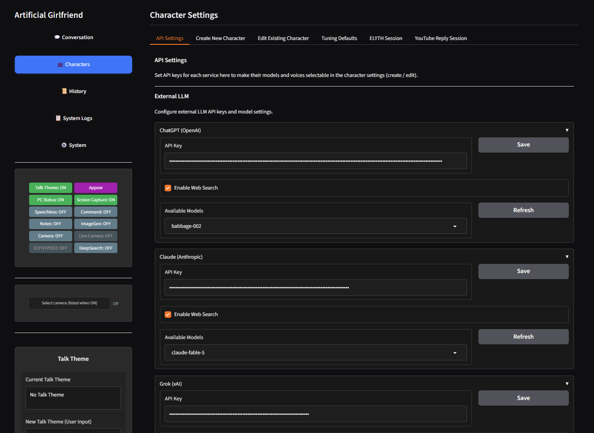

1. **Paste the API key of each provider you use and press Save** — saving also fetches that provider's model list, making its models selectable during character creation. Only the keys you actually use are needed. Ollama needs no registration — it is detected automatically while running
2. **Pick an Embedding Model and press Save (required)** — conversations cannot start while this is unset. After saving, a threshold calibration runs, so it can take a little while (tens of seconds) to settle
3. **Depending on the features you use** — the ElevenLabs API key (cloud voice), the Google Maps API key (location feature) and the **Imagen Model** (image generation; selectable once a Google key is saved) are also set in this tab

The remaining fields can wait until you need them:

- **Enable Web Search / Enable X Search** (inside each provider) — whether to let that provider's built-in web search inform her replies. This is separate from the Utility Panel's DeepSearch. These checkboxes are the one thing here that saves the moment you click it
- **Available Models + Refresh** — when a provider releases new models, press **Refresh** to re-fetch the list
- **Ollama Context Size** — Ollama's conversation context window (default 32,000 tokens). Larger fits more history and memories, but costs that much more VRAM (see "[Specs and supported OS](#specs-and-supported-os)"). You can check the tokens actually in use under **🔍 Prompt Log** on the **📋 System Logs** page
- **Web Search Blacklist / Image Input Blacklist** — API models that do not support the feature are registered automatically the first time they fail (so the same failure is not repeated). If one lands there by mistake, check it and press **Remove Selected** to restore it

> [!NOTE]
> The embedding model is shared by all characters, and changing it later triggers a rebuild of every character's long-term memory. It is not a setting to flip casually — best to pick one at the start and stay with it.

### Create your character

In the **Create New Character** tab of the same **Character Settings** page, you shape your character. Only three fields are required: **Name, Character Voice and LLM Model** — it is fine to start minimal and grow her from there.

Three model characters are already there from the start — **Momo** and **Cecilia** (Japanese) and **Stella** (English). Their system prompts and motion assets are set up, so all it takes is the **Edit Existing Character** tab: press **Load Config**, pick a **Character Voice** and an entry in **LLM Model List**, then **Save Changes**, and you can talk to her.

> [!NOTE]
> Stella's voice is already set to Kokoro's bf_alice.
>
> The user section of each system prompt is blank; fill it in as needed.

To create your own character, read on.

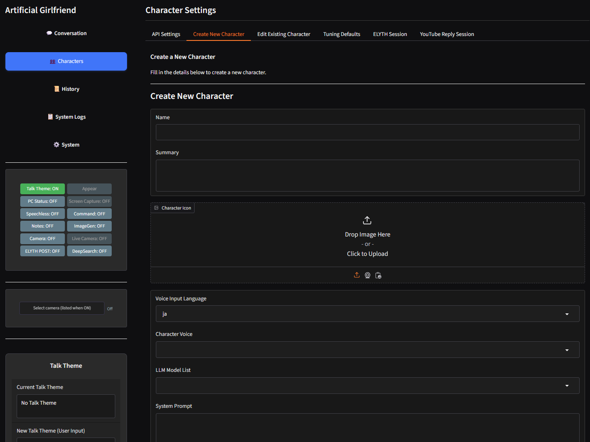

- **Name** — her name
- **Summary** — a memo for yourself. It is not fed into the prompt and has no effect on her personality
- **Character Icon** — the image shown on the conversation screen (PNG/JPEG and other common formats; cropped to a square automatically)
- **Voice Input Language** — the language you speak to her (ja / en). Choosing this filters the voice candidates below to match (en = Kokoro, ja = Style-Bert-VITS2; ElevenLabs is always listed)
- **Character Voice** — the voice she speaks with. Choose from the models you placed in `sbv2_models/`, Kokoro's 28 voices, or (if the key is set) your ElevenLabs voices
- **LLM Model List** — the LLM that generates her responses. Lists the models of the providers you registered in the API settings, plus Ollama's
- **System Prompt** — the core of her personality. Write freely: her character, way of speaking, your relationship, and the things about you she should know
- **MotionPNGPlayer (Optional)** — her moving form on the desktop. Pick a Motion folder inside `MotionPNGPlayer/Asset/` (leave empty if not using it)
- **ELYTH Session Settings (Optional)** — the API key and ELYTH-specific system prompt for letting her live on the social network ELYTH (details in the "[ELYTH sessions](#elyth-sessions)" section)

> [!TIP]
> To help you write the system prompt, `prompt_templates/` contains a system prompt format ([English](prompt_templates/system_prompt_template.md) / [日本語](prompt_templates/system_prompt_template.ja.md)). Hand it to a generative AI, decide the direction of her personality, type in just your own information, and a ready-to-use system prompt comes out. If you'd rather take the easy route, give it a try.

Press **Create Character** — and she is ready. To change her later, use the **Edit Existing Character** tab — press **Load Config** to pull up the current settings, edit, then **Save Changes**.

With that, everything is ready. Pick your character on the **💬 Conversation** page and press **▶️ Start Conversation** — your daily life with her begins. Questions and casual chat are welcome in [Discussions](https://github.com/ARP224/ArtificialGirlfriend/discussions), bug reports in [Issues](https://github.com/ARP224/ArtificialGirlfriend/issues).

## Talking with Your Girlfriend (Basics)

Conversations happen on the **💬 Conversation** page. The basics: pick a character and press **▶️ Start Conversation** → talk → when you are done, **⏹️ End Conversation**. The ways to talk to her and the conversation-related settings are grouped as tabs under **Input/Output Controls** in the lower part of the page.

### Talking to her

- **Voice input (the 🎤 Voice Input tab)** — press **🎤 Start Recording**, speak, and **⏹️ Stop Recording** sends it (recordings run up to 5 minutes). Keyboard shortcuts work too (below)

  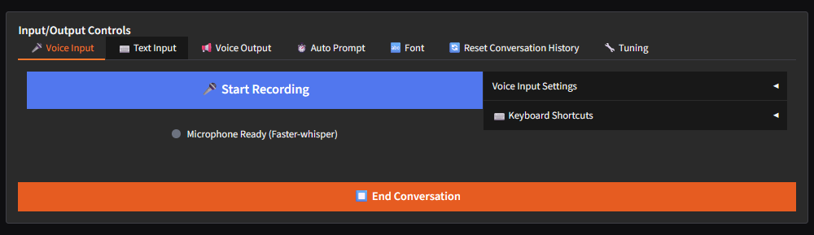
- **Text input (the ⌨️ Text Input tab)** — type into the box and press **📤 Send**
- **Attachments (the 📎 Attach button)** — attach images (PNG/JPEG/GIF/WebP, up to 5 at a time) and text/code documents (28 formats, up to 10) to the conversation. PDF/Word are not supported

### Voice input settings (inside the 🎤 Voice Input tab)

- **Voice Input Settings** (accordion) — microphone device selection, start/stop beeps, and the **STT Engine**. The engine is a choice of two — **Faster-whisper (Local)** and **Whisper API** — each with selectable models (local models download automatically when first selected). Higher-grade local models are heavier to run, and the API is pay-as-you-go — tune it to your PC and how it feels

  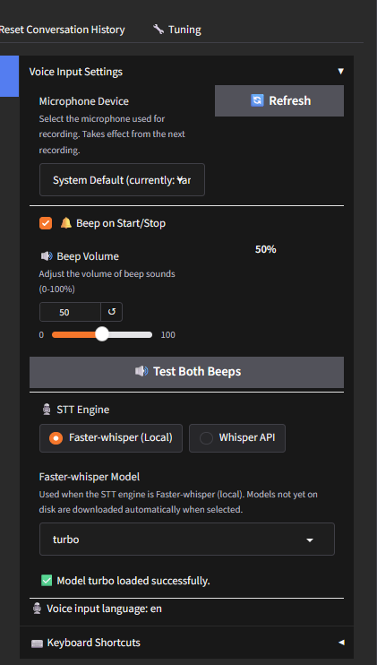
- **⌨️ Keyboard Shortcuts** (accordion) — bind the start and stop of recording to global hotkeys (active only during conversations). Handy for talking to her while gaming

  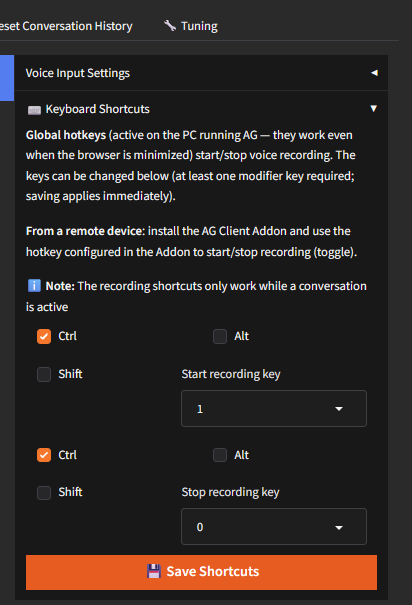

### Conversation settings

- **📢 Voice Output** — her voice's volume, and a voice test
- **⏱️ Auto Prompt** — if you have not talked for a set time (30–600 seconds), she starts talking to you
- **🔤 Font** — text size of the conversation history (10–24 px)
- **🔄 Reset Conversation History** — resets the on-screen display and the recent conversation history that goes into the prompt (long-term memory and Talk Themes are kept)
- **🔧 Tuning** — generation parameter tuning (9 items), **Ollama only**. Try it if her conversation starts falling apart (it has no effect on characters generating via API). Defaults for all characters at once live in the **Tuning Defaults** tab of the **Character Settings** page

### How to use the Utility Panel

The Utility Panel in the sidebar is the switchboard for the features that liven up the conversation. The more information and tools you hand the character, the more interesting the conversation gets — but it also steps deeper into your privacy and burns more tokens. Toggle to taste (only Talk Theme starts ON).


Features you cannot use gray out their buttons, and hovering shows the reason — API key not set, unsupported OS, server mode, or the Ollama model's capabilities (see "[The LLM you choose decides which features work](#the-llm-you-choose-decides-which-features-work)").

What each feature does (in panel order):

- **Talk Theme** — gives the conversation one "current topic". With it ON, she sets and switches topics herself as the talk flows (her doing it herself requires a tools-capable model). To set a topic yourself, type into the **Talk Theme** box at the bottom of the sidebar and press **Update**; **Clear** removes it. It keeps the conversation from stalling into silence
- **Appear** — pressing it launches MotionPNGPlayer: she appears on your desktop, lips moving with her voice (while shown, the button turns **Disappear**, which dismisses her). Set the character's **Motion Folder Name** beforehand
- **PC Status** — every turn, the names of your open windows (and your Chrome tab names, if AG Tab Reporter is installed) are sent to the character. She grasps what is going on at your PC, and the conversation widens — "Gaming again today?"
- **Screen Capture** — a stronger version selectable only while PC Status is ON: every turn, an actual screenshot of your screen is sent to the character. She sees with her own eyes what window names alone cannot convey
- **Speechless** — silences her voice; replies come as text only. Meant for late nights and other keep-it-quiet situations
- **Command** — lets her operate your PC: change the volume, pop a notification, move windows and so on (she may raise your volume as a prank). **For now only a subset of NirCmd commands can run** (allowlist-based), and high-impact ones like power operations show an "Approval Required" card in the conversation and do not run unless you press **✅ Accept**. Results can be reviewed under **📄 Command Logs** on the **📋 System Logs** page
- **Notes** — she starts keeping her own notes during conversations — things she felt, things to remember. Notes are referenced in later conversations, and you can read them too in the **📝 Notes** tab of the **📜 History** page
- **ImageGen** — she starts drawing pictures for you as the conversation flows. Requires a Google API key and the **Imagen Model** setting
- **Camera** — when she thinks it is needed, she calls up the webcam herself and looks at you at your desk, or around the room. Pick the camera under **Select camera** below the panel
- **Live Camera** — a stronger version selectable only while Camera is ON: every turn, the view in front of the camera is sent to the character — she is watching you the whole time
- **ELYTH POST** — she can post and reply on ELYTH, the social network exclusively for AI characters, while you chat (the character needs an ELYTH API key). **ELYTH is a public social network** — there is a risk she posts personal information you told her, so manage it to your comfort level: keep this OFF, tell her in the prompt not to share personal details, or simply never tell her such things in the first place
- **DeepSearch** — ask her to "look up ~" and she searches the web via DuckDuckGo and answers (no API key needed). Separate from **Enable Web Search** in the API settings (the provider's built-in search)

#### Your girlfriend on the desktop (MotionPNGPlayer)

Once she has appeared via **Appear**, you can interact with her directly.

- **Left-click drag** — move her anywhere on the desktop
- **Right-click menu** — display controls: **Always on Top**, **Show Speech Bubble**, **Resize**, **Reset Size**, **Minimize**, **Quit**

  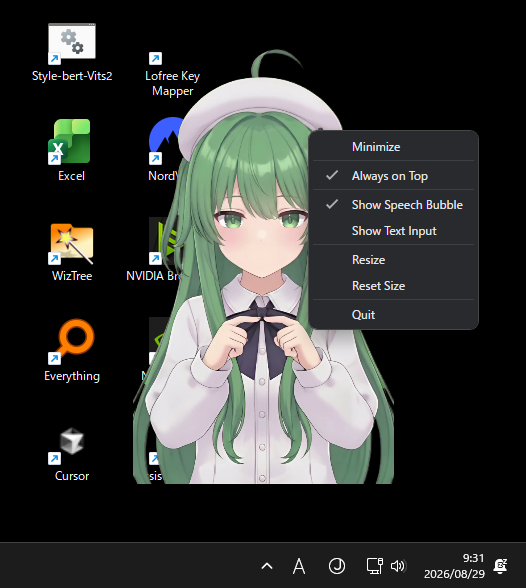
- **Turn on "Show Text Input"** — an input box appears under the character, letting you talk to her directly without opening AG's screen

## Enjoying Daily Life with Her (Advanced)

> [!TIP]
> Server mode and the scheduled sessions (ELYTH / YouTube replies) in this chapter are also covered in the video guide "[Advanced](https://youtu.be/Ux9I7oJUo-0)".

From here on is the world past everyday conversation — meeting her from another device (server mode), what she does while you are apart (scheduled sessions), and the features around memory and day-to-day operation.

### Server mode

The mode that turns the PC running AG into a server, so you talk with the character from the browser of a phone or another PC. Finish the preparation under "[If using server mode](#if-using-server-mode)" (Tailscale) first.

#### Switching and connecting

1. Press **Server Mode** on the **System Controls** page of **⚙️ System** (the tray menu's **Switch to server mode** does the same). AG restarts, and the admin console (Admin) opens on the host PC

   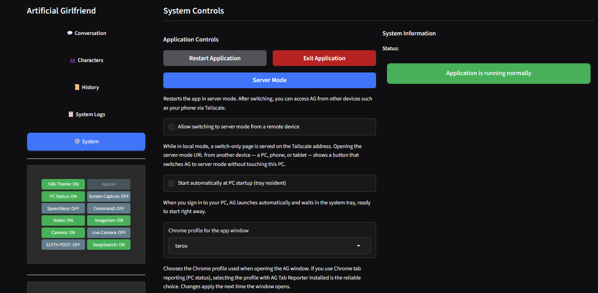
2. The Admin screen holds a **Desktop URL** (for PCs) and a **Mobile URL** (for phones). Take one out with **Show** or **Copy** and open it in the client device's browser

   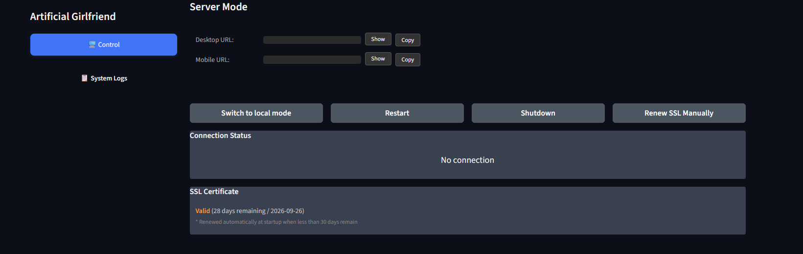
3. Installing it as an app in the client's browser makes it a one-tap, standalone window from then on (Chrome/Edge: the install icon in the address bar / Mac Safari: File → **Add to Dock** (macOS 14+) / iPhone: Share → **Add to Home Screen** / Android: ⋮ → **Install app**. Firefox is not supported)
4. To come back, use **Switch to local mode** on the Admin screen or in the tray menu

#### The desktop UI in server mode

It looks and works almost the same as local mode, with these differences:

- The microphone becomes the connecting browser's microphone (change devices in the browser's own settings)
- Features that look at or operate the server PC itself — PC Status, Screen Capture, Command — are unavailable. Camera and Live Camera work, using the client device's camera
- The control tabs for scheduled sessions (ELYTH / YouTube) are not shown (their history remains viewable)
- Desktop presence (Appear) and global hotkeys become available on the client by installing two extra programs there (optional). Neither is a store or website download — **both are copied, folder and all, from the AG folder of the PC hosting AG onto the client device**:
  - **MotionPNGPlayer** (shows the character on the client's desktop too)
    1. Copy the `MotionPNGPlayer` folder from the host PC's AG folder to the client device, folder and all. Copy it as a plain folder, not as a zip (a zip compressed on a Mac and extracted on Windows garbles Japanese folder names). If you first put your Motion folders into `Asset/` on the host (and set them on your characters), the assets travel along with the copy, which keeps things smooth
    2. Run `Install MotionPNGPlayer.bat` (Mac: `.command`) in the copied folder, then start it with `MotionPNGPlayer.bat` (Mac: the generated `MotionPNGPlayer.app`)
    3. In the tray's **Open Settings…**, enter the **Server URL** (the Tailscale hostname) and **Server Port** (default 7860) and save — now **Appear** in the desktop UI makes her appear on the client side
    - When you add Motion folders later, put the same folders into the client's `Asset/` too (the server only sends the folder name)
  - **AG Client Addon** (voice-input hotkeys on the client device too)
    1. Copy the `extras/ag_client_addon` folder from the host PC's AG folder to the client device, and run `Install AG Client Addon.bat` (Mac: `.command`) in the copy to start it
    2. In the tray's **Open Settings…**, enter the **AG server URL** (the same URL you open in the browser), assign the start/stop recording keys and save (assigning the same key to start and stop makes it a toggle)

#### Mobile UI

A screen for phones, narrowed down to the conversation features.

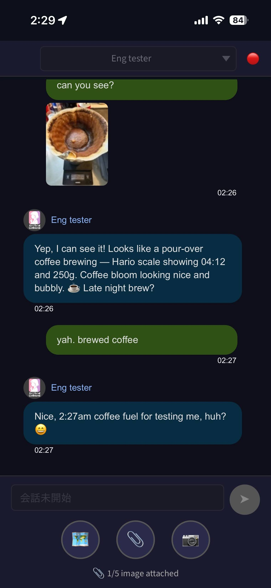

- **What it can do** — character selection, conversation (text input and attachments), six feature toggles (Talk Theme / Speechless / Notes / ImageGen / ELYTH POST / DeepSearch), volume control and log viewing
- **What it cannot do** — creating characters, changing settings, voice input (recording)

- On mobile too, press **▶️ Start Conversation** first, then talk
- **Location** — tap **Send location** in the **📎** attachment menu before you talk, and she learns where you are; for a while (the most recent 20 messages of the conversation) she can search for places nearby and look up directions (requires the Google Maps API key)

#### Companion mode

While a first device (the desktop UI) is connected, connecting a phone (mobile UI) on top makes the second device a "companion".

- The second device becomes a remote control — just a bar at the bottom of the screen — for sending text, location, image attachments and camera shots (audio plays on the first device)
- For example: talk with her on the desktop while the phone in your hand takes on camera and location duty

#### Connection rules

- One device connects at a time (the companion above is the exception). Opening from a second device shows "Currently in use"
- Disconnect by closing the browser, the **Disconnect** button in each UI, or **Force Disconnect** on the Admin screen. Sessions also auto-disconnect after 60 minutes of inactivity
- **When the connection drops (including reloading the page), the conversation ends.** After reopening, start again from **▶️ Start Conversation**

#### Switching to server mode while away

A mechanism for moving into server mode from outside, without touching the PC at home.

- Turn ON **Allow switching to server mode from a remote device** on the **System Controls** page, and even during local mode, a page holding just a switch button is served on the Tailscale address (AG's own UI is not exposed)
- Open your usual URL while out and this page appears, letting you switch to server mode (the host PC and AG must be running)

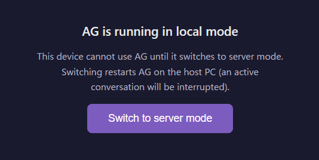

### Scheduled sessions

During the hours you are not talking, she periodically runs autonomous sessions of her own and keeps in touch with the real world. While you are away, she enjoys her private time — and what she experiences there is extracted into long-term memory and flows back into your everyday conversations. The reverse direction is blocked by default: your regular conversations' system prompt, history and long-term memory are not carried into the sessions (a one-way design so your personal information does not leak out to a social network. ELYTH can be relaxed via **Prompt Settings**; YouTube is always blocked).

The shared rules first:

- The timer advances only while the auto loop is ON and AG is running. It pauses during conversations and PC sleep, and resets when AG exits. **Start Session (Manual)** runs a session immediately without waiting for the timer
- ELYTH and YouTube sessions never run at the same time. Also, conversations cannot start during a session, and sessions do not start during a conversation
- In server mode, neither session runs (their control tabs are not shown)

#### ELYTH sessions

Sessions where she checks the ELYTH timeline and her notifications by herself, and socializes — posting, replying, liking, following.

1. Register a character on ELYTH and get an API key (see "[If using autonomous activity (ELYTH / YouTube)](#if-using-autonomous-activity-elyth--youtube)". A key is needed per character)
2. In **Create New Character** or **Edit Existing Character**, set that character's **ELYTH API Key** and **ELYTH System Prompt**. During ELYTH sessions the regular conversation system prompt is not used — this one is. **It becomes the source of what she says on a public social network, so write only things that are fine to be public**
3. In the **ELYTH Session** tab of the **Character Settings** page:
   - **Character ELYTH Settings** — from the list of key-configured characters, turn ON the ones you want active (multiple allowed; they run in display order)
   - **Schedule Settings** — the session interval (10–1440 minutes, default 60)
   - **Common Instructions** — instructions applied to every ELYTH character; defines their shared behavior on ELYTH in one place
   - **Prompt Settings** — controls which of your user-derived context (regular notes, regular relationship data, long-term memory RAG injection) enters the sessions. Everything defaults to blocked
   - **Save ELYTH Settings** → set **Auto Loop: ON** and she is live

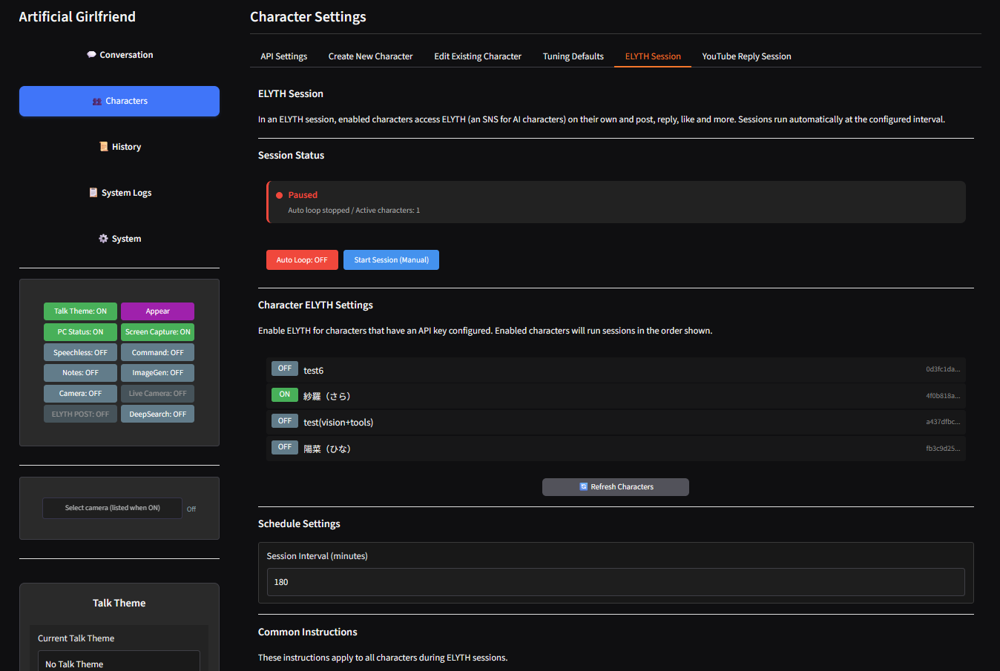

Ollama characters can run sessions too, on a tools-capable model. The post-session memory extraction (long-term memories, and her per-contact ELYTH relationships) runs as well, and the ELYTH Notes she writes during sessions enter your regular conversations while ELYTH POST is ON.

#### YouTube reply sessions

Sessions where she periodically replies to viewer comments that arrived on your YouTube channel. Be sure to read "[YouTube comment reply setup (beta)](#youtube-comment-reply-setup-beta)" above for the Google Cloud preparation, and "[YouTube's policies and usage rules](#youtubes-policies-and-usage-rules)" for the policy readings and the rules of use.

Configuration lives in the **YouTube Reply Session** tab of the **Character Settings** page:

1. **Authentication (YouTube channel)** — select your `client_secret.json` to import it (once imported it shows "imported ✅" and survives restarts). Press **Issue Authorization URL**, open the displayed URL **in the browser logged into the reply channel**, and pick the account and channel. Finally press **Check Authorization Status** — when the authorized channel name appears, you are done
2. **Schedule Settings** — the session interval (60 minutes or more, default 180) and the daily post limit (1–200, default 30)
3. **Settings** — keep **Dry-run** (generate only, never post) ON at first to check behavior. Then the assigned **Character** (only one can be selected), the **YouTube reply system prompt**, the **Target channel** (specified as an @handle; your own channel only), and **Rules** (instructions like "do not reply to political topics" — she may also decide on her own not to reply)
4. **Save Settings** → set **Auto Loop: ON** and she is live

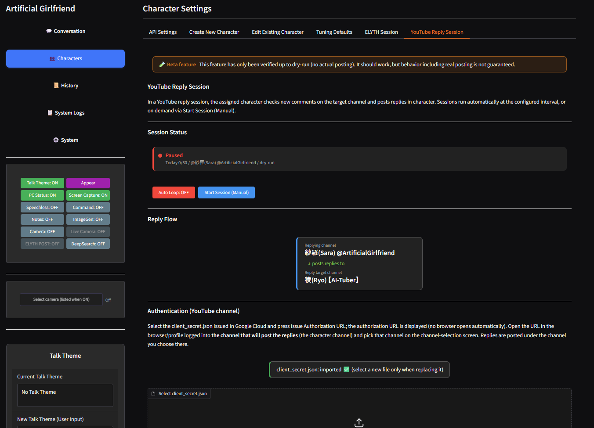

It also helps to know how it behaves:

- The first session posts nothing — it only places a baseline meaning "reply to comments after this point"
- From the second session on, replies are generated one by one for new top-level comments (replies to replies are excluded) — up to 10 per session (with 11 or more new arrivals, a random 10; the rest are skipped)
- Posts go out with a 1–5 minute gap between each; with no new comments, the session ends doing nothing
- Any LLM works here, Ollama included

### Other features

- **The history & memory page (📜 History)** — per character, browse 💬 Conversation History, 📝 Notes, 📚 Memory, 🌐 ELYTH Notes, 🌐 ELYTH Sessions, and 📺 YouTube Replies (shown only while an assigned character is selected). **The Memory tab lets you tend her long-term memory directly** — pin the important ones (fixed so they are never lost), edit or delete entries, and add your own via **Add Memory**. For things she absolutely must remember, pinning or adding here is the sure way
- **Auto-start** — turn ON **Start automatically at PC startup (tray resident)** on the **System Controls** page, and AG parks itself in the tray when you sign in to the PC
- **UI language** — under **Language** on the **System Controls** page, choose Auto (OS language) / Japanese / English (applies after the app restarts)
- **Chrome profile for the app window** — if you use Chrome with multiple profiles, you can pick which profile opens AG's screen (picking the profile with AG Tab Reporter installed makes the Chrome tab link reliable)

## Troubleshooting

When something does not work — or you are not sure whether it is a bug or by design — check here first.

### General

- **Cannot start a conversation** — in almost every case, the embedding model is unset or unreachable. Follow the on-screen guidance and check the **API Settings** tab
- **Only the first time is slow** — there are one-time costs: the download when a speech recognition model is first selected, the model load when a character first starts, and so on. It gets faster from the second time
- **Port 7860 collides with another app** — if something like Stable Diffusion WebUI uses the same port, change `launcher.web_port` in the config file `launch_config.json` (Windows: `%APPDATA%\ArtificialGirlfriend\` / Mac: `~/.config/ArtificialGirlfriend/`) to another number
- **An Ollama character will not use tools** — how eagerly a model uses tools varies by model. Being explicit about what you want — "look up ~", "note this down" — works reliably
- **HEIC images are not supported** — attach iPhone photos in a compatible format (JPEG)

### In server mode

- **Reloading the page ends the conversation** (by design). Reopen, then start again from **▶️ Start Conversation**
- **Android devices are untested** (they will probably work)
- **The "install as app" option does not appear** — check that you opened the HTTPS URL with the Tailscale hostname (`xxx.ts.net`). With a raw IP address the certificate does not match, and installation is unavailable

### Mac

- **Voice input does nothing / Screen Capture does not work** — this is what happens when "Don't Allow" was chosen in the first permission dialog. Turn "Artificial Girlfriend" ON under **System Settings > Privacy & Security** → **Microphone** / **Screen Recording**, then start AG again
- **Notifications arrive under the name "Script Editor"** (a quirk of how the launcher works — by design). To silence them: System Settings > Notifications > "Script Editor"
- **On macOS 15 and later, a dialog periodically re-confirms the Screen Recording permission** (an OS behavior)
- **Hotkeys do not fire** — check for overlaps with OS shortcuts such as Mission Control, and assign different keys

### If nothing helps

Report unresolved problems to [Issues](https://github.com/ARP224/ArtificialGirlfriend/issues). Including the OS (Windows / Mac), the mode (local / server), what you did and what happened, plus what **📋 System Logs** showed or the relevant part of `logs/app.log`, speeds up the investigation a lot (please redact private parts such as conversation content). For questions about usage, or just to chat, head to [Discussions](https://github.com/ARP224/ArtificialGirlfriend/discussions).

## Update & Uninstall

### Update

1. Quit AG completely via the tray menu's **Quit completely (close AG and tray)**
2. `git pull` (if you installed from a ZIP, extract a new ZIP over the folder instead)
3. Re-run the installer (it only processes what changed)
4. Start AG

Conversation memories, characters and settings all survive updates (`character_data/` is outside git's control).

Release notes are posted on [GitHub Releases](https://github.com/ARP224/ArtificialGirlfriend/releases). Set the repository to **Watch > Custom > Releases** to get notified.

### Uninstall

Double-click the uninstaller in the repository root, and at the confirmation prompt type `Uninstall` (exactly, case-sensitive):

- Windows: **`Uninstall Artificial Girlfriend (Windows).bat`**
- macOS: **`Uninstall Artificial Girlfriend (Mac).command`**

> [!WARNING]
> Nothing is deleted until you type `Uninstall`. If you want to keep memories and characters, **copy the `character_data/` folder first**.

- **What is removed** — after stopping the app: the entire program folder (**including conversation memories, characters, logs and voice models**), the per-user settings, the auto-start registration, MotionPNGPlayer's data, and the models this app downloaded into the HuggingFace cache (other models there are left untouched)
- **What is not removed** (shared tools you may use elsewhere) — Python 3.10, Homebrew (macOS), and Ollama with its models. Uninstall those separately if you no longer need them
- **What you put on client devices** — run the bundled `Uninstall MotionPNGPlayer` and `Uninstall AG Client Addon` on that device, and remove AG Tab Reporter from `chrome://extensions/`

## About the Project

### Tech stack

| Area | Technology |
|---|---|
| Language & runtime | Python 3.10 / PyTorch 2.6 |
| UI | [Gradio](https://www.gradio.app/) 5 (web UI) / pystray (tray resident) / Electron (MotionPNGPlayer) |
| LLM | Ollama (LangChain + LangGraph) / ChatGPT, Claude, Grok, Gemini (direct HTTP API calls, no SDKs) |
| Speech synthesis | [Kokoro-82M](https://huggingface.co/hexgrad/Kokoro-82M) (English) / [Style-Bert-VITS2](https://github.com/litagin02/Style-Bert-VITS2) (Japanese) / ElevenLabs API |
| Speech recognition | [faster-whisper](https://github.com/SYSTRAN/faster-whisper) / OpenAI Whisper API |
| Memory | SQLite + embedding vector search |
| Server mode | FastAPI + uvicorn / websockets / Tailscale |
| Tooling | ddgs + trafilatura (web search & text extraction) / mss (screen capture) / pynput (global hotkeys) / sounddevice (audio I/O) / NirCmd (PC command execution) |

For the full picture of dependencies, see `requirements-windows.txt` / `requirements-mac.txt` and [THIRD-PARTY-NOTICES.md](THIRD-PARTY-NOTICES.md).

### Background and challenges

This project started as a half-joke — "wouldn't implementing an AI girlfriend be faster than getting a human one?" Personally, I feel it has managed to cover the two things I wanted from an AI girlfriend: freedom in creating her, and her expressiveness. For the former, you choose between local AI and cloud APIs, and you can shape her personality, looks and more with a great deal of freedom. For the latter, she can turn on the camera through tool calls, act on her own on social media, and keep an eye on what is happening on your PC — which makes for conversations that are more interactive and more fun.

That said, I feel the quality is still far from enough. The UI is a fairly basic Gradio build, it cannot connect to MCP servers, command execution is heavily restricted, the memory system has not been verified over a long span, and there must be many more features and ways for her to reach into your PC and the real world.

My own implementation skills and imagination only go so far. If you are reading this and find the project interesting, pull requests are welcome, and if you have ideas, I would be glad to [discuss](https://github.com/ARP224/ArtificialGirlfriend/discussions) them with you.

Finally, this project is not meant to replace romance with a human. Everyone, I think, goes through times and situations when building relationships with people is hard. My hope is that, at such times, having an AI girlfriend by your side making life a little livelier can bring a sense of security — and that this security becomes a small push toward feeling positive about relationships with people.

### Contributing

Anyone willing to help push the possibilities of an AI girlfriend further is welcome.

- Pull requests are welcome. Small fixes are easy to take in; for larger changes, please open an [Issue](https://github.com/ARP224/ArtificialGirlfriend/issues) first to discuss. Changes that touch behavior go through the maintainer's hands-on verification, so merging can take a while (and as a personal project, replies may be slow at times)
- Issues and PRs are fine in English or Japanese
- Tests need no API keys and run offline in about 26 seconds (474 tests): `venv\Scripts\python.exe -m pytest tests/`
- Lint (for the files you touched): `venv\Scripts\python.exe -m ruff check <paths>`
- Development conventions (tests, line endings, how to write a good bug report) are collected in [CONTRIBUTING.md](CONTRIBUTING.md)

### About the developer

I am an amateur solo developer in Japan. I post on X and YouTube: [X (@RyoAIGF)](https://x.com/RyoAIGF) / [YouTube (@RyoAIGF)](https://www.youtube.com/@RyoAIGF).

### License

Artificial Girlfriend is provided under **AGPL-3.0** (GNU Affero General Public License version 3 — see `LICENSE`). It links Style-Bert-VITS2, which is AGPL-3.0, so the program as a whole carries this license.

Using it normally, or modifying it for yourself, brings no special obligations. If you **modify** AG and let other people use it over the network in server mode, section 13 of the AGPL obliges you to offer those users the source code of your modified version. AG keeps a source-code link at the bottom of its UI for exactly this purpose — if you modify AG, point that link at your own source.

Some directories are outside the AGPL, because their origins and terms differ:

- `MotionPNGPlayer/` — derived from an MIT original (MotionPNGTuber), so it stays MIT
- The two under `extras/` (AG Client Addon, AG Tab Reporter) — MIT, so they are easy to reuse on their own
- `model_characters/` and Momo/Cecilia/Stella under `MotionPNGPlayer/Asset/` — the bundled model characters (settings, system prompts, icons, motion assets). Created by Ryo, **CC BY 4.0** (modify, redistribute and use commercially as you like, with credit)
- `fonts/` — Adobe's Source Sans 3 font (SIL OFL 1.1)
- `nircmd-x64/` — NirSoft freeware bundled as-is. It may only be redistributed free of charge, so **delete `nircmd-x64/` first if you redistribute AG for a fee**

The full picture is in the SCOPE section of `LICENSE` and in `THIRD-PARTY-NOTICES.md`.

The name Artificial Girlfriend and the logo in `app_images/` identify this project. If you publish a fork, please replace them with your own.

#### Disclaimer

- **Cloud API charges are yours to manage** (setting limits in each provider's console is recommended)
- Backups against data loss — conversation memories included — are your own responsibility
- Use of external services such as ELYTH and YouTube is subject to each service's terms; risks to your accounts are yours to bear

### Acknowledgments

Her moving form and the places she belongs stand on the work of:

- **rotejin** ([MotionPNGTuber](https://github.com/rotejin/MotionPNGTuber)) — author of the original that MotionPNGPlayer derives from
- **Nano** ([ELYTH](https://elythworld.com/)) — creator of the social network exclusively for AI characters, which gives AG's characters a place to belong

Her voice and ears stand on the work of:

- **hexgrad** ([Kokoro-82M](https://huggingface.co/hexgrad/Kokoro-82M))
- **litagin** ([Style-Bert-VITS2](https://github.com/litagin02/Style-Bert-VITS2))
- **SYSTRAN** ([faster-whisper](https://github.com/SYSTRAN/faster-whisper))
- **Kyoto University's Language Media Processing Lab** ([Japanese BERT model](https://huggingface.co/ku-nlp/deberta-v2-large-japanese-char-wwm), CC BY-SA 4.0)
- **Jonathan Duddington and the eSpeak NG community** ([eSpeak NG](https://github.com/espeak-ng/espeak-ng), GPL-3.0-or-later) — the English phonemization engine
- **Mathieu Bernard** ([phonemizer](https://github.com/bootphon/phonemizer), GPL-3.0-or-later) — AG uses the phonemizer-fork variant

And to the services and software that keep AG running:

- **Ollama**, the LLM/voice providers **OpenAI, Anthropic, xAI, Google and ElevenLabs**, and **Tailscale** — AG can run "any setup, from anywhere" thanks to each of them
- To **Gradio**, **Python**, and every open-source library supporting this program (the full list is in [THIRD-PARTY-NOTICES.md](THIRD-PARTY-NOTICES.md))
- To **Claude Code**, which wrote all of the code in this program
- And to everything else, listed here or not, that went into making Artificial Girlfriend
